<!-- GENERATED:MODEL -->
---
tags: [odoo, enterprise, generated, model]
---

# pricer.store

- Module: [[docs/Enterprise Addons/pos_pricer/pos_pricer|pos_pricer]]
- Scope: Enterprise Addons
- Defined in module: yes
- Source files: `models/pricer_store.py`
- Python classes: `PricerStore`
- Description: Pricer Store regrouping pricer tags

## Field footprint

- Detected fields: 14
- Field types: `Char` x 11, `Datetime` x 1, `One2many` x 2
- Relation fields: 2

## Sample fields

- `auth_url`: `Char` (compute `_compute_auth_url`)
- `create_or_update_products_url`: `Char` (compute `_compute_create_or_update_products_url`)
- `dummy_prod_barcode`: `Char` (store `False`)
- `dummy_tag_barcode`: `Char` (store `False`)
- `last_update_datetime`: `Datetime`
- `last_update_status_message`: `Char`
- `link_tags_url`: `Char` (compute `_compute_link_tags_url`)
- `name`: `Char`
- `pricer_login`: `Char`
- `pricer_password`: `Char`
- `pricer_store_identifier`: `Char`
- `pricer_tag_ids`: `One2many` (comodel `pricer.tag`)
- `pricer_tenant_name`: `Char`
- `product_ids`: `One2many` (comodel `product.product`)

## Method hints

- Detected methods: 7
- Action methods: `action_button_update_pricer_tags`
- Compute methods: `_compute_auth_url`, `_compute_create_or_update_products_url`, `_compute_link_tags_url`
- Onchange methods: none

## Direct relation diagram

```plantuml
@startuml
!define ODOO_COLOR_PRIMARY #714B67
!define ODOO_COLOR_ACCENT #875A7B
!define ODOO_COLOR_BG #FAF7FA

skinparam backgroundColor ODOO_COLOR_BG
skinparam defaultTextAlignment left
skinparam ArrowColor ODOO_COLOR_ACCENT
skinparam ClassBackgroundColor white
skinparam ClassBorderColor ODOO_COLOR_PRIMARY
skinparam ComponentBackgroundColor white
skinparam ComponentBorderColor ODOO_COLOR_PRIMARY
skinparam NoteBackgroundColor #FFF8FF
skinparam NoteBorderColor ODOO_COLOR_ACCENT
skinparam SequenceLifeLineBorderColor ODOO_COLOR_ACCENT
skinparam SequenceLifeLineBackgroundColor #FFFFFF
skinparam SequenceParticipantBorderColor ODOO_COLOR_PRIMARY
skinparam SequenceParticipantBackgroundColor #FFFFFF
skinparam sequence {
  ArrowColor ODOO_COLOR_ACCENT
  ActorBorderColor ODOO_COLOR_PRIMARY
}
title pricer.store - Direct Relations
class "pricer.store" as pricer_store
class "pricer.tag" as pricer_tag
class "product.product" as product_product
pricer_store --|> product_product : product_ids
pricer_store --|> pricer_tag : pricer_tag_ids
@enduml
```

## Navigation

- **Parent:** [[docs/Enterprise Addons/pos_pricer/Models]]

<!-- GENERATED:MODEL -->
