<!-- GENERATED:MODEL -->
---
tags: [odoo, enterprise, generated, model]
---

# pricer.tag

- Module: [[docs/Enterprise Addons/pos_pricer/pos_pricer|pos_pricer]]
- Scope: Enterprise Addons
- Defined in module: yes
- Source files: `models/pricer_tag.py`
- Python classes: `PricerTag`
- Description: Pricer electronic tag

## Field footprint

- Detected fields: 4
- Field types: `Boolean` x 1, `Char` x 1, `Many2one` x 2
- Relation fields: 2

## Sample fields

- `name`: `Char`
- `pricer_product_to_link`: `Boolean`
- `pricer_store_id`: `Many2one` (comodel `pricer.store`, related `product_id.pricer_store_id`)
- `product_id`: `Many2one` (comodel `product.product`)

## Method hints

- Detected methods: 4
- Action methods: none
- Compute methods: none
- Onchange methods: none

## Direct relation diagram

```plantuml
@startuml
!define ODOO_COLOR_PRIMARY #714B67
!define ODOO_COLOR_ACCENT #875A7B
!define ODOO_COLOR_BG #FAF7FA

skinparam backgroundColor ODOO_COLOR_BG
skinparam defaultTextAlignment left
skinparam ArrowColor ODOO_COLOR_ACCENT
skinparam ClassBackgroundColor white
skinparam ClassBorderColor ODOO_COLOR_PRIMARY
skinparam ComponentBackgroundColor white
skinparam ComponentBorderColor ODOO_COLOR_PRIMARY
skinparam NoteBackgroundColor #FFF8FF
skinparam NoteBorderColor ODOO_COLOR_ACCENT
skinparam SequenceLifeLineBorderColor ODOO_COLOR_ACCENT
skinparam SequenceLifeLineBackgroundColor #FFFFFF
skinparam SequenceParticipantBorderColor ODOO_COLOR_PRIMARY
skinparam SequenceParticipantBackgroundColor #FFFFFF
skinparam sequence {
  ArrowColor ODOO_COLOR_ACCENT
  ActorBorderColor ODOO_COLOR_PRIMARY
}
title pricer.tag - Direct Relations
class "pricer.tag" as pricer_tag
class "pricer.store" as pricer_store
class "product.product" as product_product
pricer_tag --> product_product : product_id
pricer_tag --> pricer_store : pricer_store_id
@enduml
```

## Navigation

- **Parent:** [[docs/Enterprise Addons/pos_pricer/Models]]

<!-- GENERATED:MODEL -->
