<!-- GENERATED:MODEL -->
---
tags: [odoo, enterprise, generated, model]
---

# product.product

- Module: [[docs/Enterprise Addons/pos_pricer/pos_pricer|pos_pricer]]
- Scope: Enterprise Addons
- Defined in module: extension only
- Source files: `models/product_product.py`
- Python classes: `ProductProduct`

## Field footprint

- Detected fields: 6
- Field types: `Boolean` x 1, `Char` x 1, `Float` x 1, `Many2one` x 2, `One2many` x 1
- Relation fields: 3

## Sample fields

- `on_sale_price`: `Float` (store `True`)
- `pricer_display_price`: `Char`
- `pricer_product_to_create_or_update`: `Boolean`
- `pricer_sale_pricelist_id`: `Many2one` (comodel `product.pricelist`)
- `pricer_store_id`: `Many2one` (comodel `pricer.store`)
- `pricer_tag_ids`: `One2many` (comodel `pricer.tag`)

## Method hints

- Detected methods: 4
- Action methods: none
- Compute methods: none
- Onchange methods: `_onchange_compute_pricing`

## Direct relation diagram

```plantuml
@startuml
!define ODOO_COLOR_PRIMARY #714B67
!define ODOO_COLOR_ACCENT #875A7B
!define ODOO_COLOR_BG #FAF7FA

skinparam backgroundColor ODOO_COLOR_BG
skinparam defaultTextAlignment left
skinparam ArrowColor ODOO_COLOR_ACCENT
skinparam ClassBackgroundColor white
skinparam ClassBorderColor ODOO_COLOR_PRIMARY
skinparam ComponentBackgroundColor white
skinparam ComponentBorderColor ODOO_COLOR_PRIMARY
skinparam NoteBackgroundColor #FFF8FF
skinparam NoteBorderColor ODOO_COLOR_ACCENT
skinparam SequenceLifeLineBorderColor ODOO_COLOR_ACCENT
skinparam SequenceLifeLineBackgroundColor #FFFFFF
skinparam SequenceParticipantBorderColor ODOO_COLOR_PRIMARY
skinparam SequenceParticipantBackgroundColor #FFFFFF
skinparam sequence {
  ArrowColor ODOO_COLOR_ACCENT
  ActorBorderColor ODOO_COLOR_PRIMARY
}
title product.product - Direct Relations
class "product.product" as product_product
class "pricer.store" as pricer_store
class "pricer.tag" as pricer_tag
class "product.pricelist" as product_pricelist
product_product --> pricer_store : pricer_store_id
product_product --|> pricer_tag : pricer_tag_ids
product_product --> product_pricelist : pricer_sale_pricelist_id
@enduml
```

## Navigation

- **Parent:** [[docs/Enterprise Addons/pos_pricer/Models]]

<!-- GENERATED:MODEL -->
