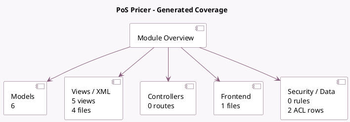

<!-- GENERATED:MODULE -->
---
tags: [odoo, enterprise, module]
---

# PoS Pricer

- Scope: Enterprise Addons
- Source: enterprise/pos_pricer
- Dependencies: [[docs/Community Addons/product/product|product]], [[docs/Community Addons/point_of_sale/point_of_sale|point_of_sale]]

## Summary

Display and change your products information on electronic Pricer tags

## Generated coverage

- Models: 6
- XML files with UI/data artifacts: 4
- Views: 5
- Actions: 2
- Menus: 3
- Rules (ir.rule): 0
- Access CSV entries: 2
- Controller units: 0
- Frontend asset files: 1

## Module map

## Detail notes

- Models: [[docs/Enterprise Addons/pos_pricer/Models|Models]] (6)
- Views and XML: [[docs/Enterprise Addons/pos_pricer/Views|Views]] (4 files)
- Frontend: [[docs/Enterprise Addons/pos_pricer/Frontend|Frontend]] (1 files)

## Key models

- `pos.config`
- `pricer.store`
- `pricer.tag`
- `product.product`
- `product.template`
- `stock.move`

## Navigation

- [[../Enterprise Addons/Enterprise Addons|Back to scope]]
- [[../../docs/docs|Back to docs]]

<!-- GENERATED:MODULE -->

