<!-- GENERATED:MODEL -->
---
tags: [odoo, enterprise, generated, model]
---

# appointment.resource

- Module: [[docs/Enterprise Addons/pos_restaurant_appointment/pos_restaurant_appointment|pos_restaurant_appointment]]
- Scope: Enterprise Addons
- Defined in module: yes
- Source files: `models/appointment_resource.py`
- Python classes: `AppointmentResource`
- Inherits: `pos.load.mixin`

## Field footprint

- Detected fields: 2
- Field types: `Json` x 1, `One2many` x 1
- Relation fields: 1

## Sample fields

- `is_used`: `Json` (comodel `Is Used`, compute `_compute_is_used`)
- `pos_table_ids`: `One2many` (comodel `restaurant.table`)

## Method hints

- Detected methods: 3
- Action methods: none
- Compute methods: `_compute_is_used`
- Onchange methods: none

## Direct relation diagram

```plantuml
@startuml
!define ODOO_COLOR_PRIMARY #714B67
!define ODOO_COLOR_ACCENT #875A7B
!define ODOO_COLOR_BG #FAF7FA

skinparam backgroundColor ODOO_COLOR_BG
skinparam defaultTextAlignment left
skinparam ArrowColor ODOO_COLOR_ACCENT
skinparam ClassBackgroundColor white
skinparam ClassBorderColor ODOO_COLOR_PRIMARY
skinparam ComponentBackgroundColor white
skinparam ComponentBorderColor ODOO_COLOR_PRIMARY
skinparam NoteBackgroundColor #FFF8FF
skinparam NoteBorderColor ODOO_COLOR_ACCENT
skinparam SequenceLifeLineBorderColor ODOO_COLOR_ACCENT
skinparam SequenceLifeLineBackgroundColor #FFFFFF
skinparam SequenceParticipantBorderColor ODOO_COLOR_PRIMARY
skinparam SequenceParticipantBackgroundColor #FFFFFF
skinparam sequence {
  ArrowColor ODOO_COLOR_ACCENT
  ActorBorderColor ODOO_COLOR_PRIMARY
}
title appointment.resource - Direct Relations
class "appointment.resource" as appointment_resource
class "restaurant.table" as restaurant_table
appointment_resource --|> restaurant_table : pos_table_ids
@enduml
```

## Navigation

- **Parent:** [[docs/Enterprise Addons/pos_restaurant_appointment/Models]]

<!-- GENERATED:MODEL -->
