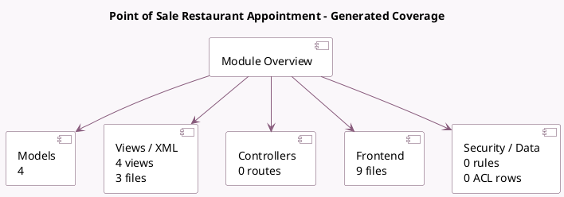

<!-- GENERATED:MODULE -->
---
tags: [odoo, enterprise, module]
---

# Point of Sale Restaurant Appointment

- Scope: Enterprise Addons
- Source: enterprise/pos_restaurant_appointment
- Dependencies: [[docs/Community Addons/pos_restaurant/pos_restaurant|pos_restaurant]], [[docs/Enterprise Addons/pos_appointment/pos_appointment|pos_appointment]]

## Summary

This module lets you manage online reservations for restaurant tables

## Generated coverage

- Models: 4
- XML files with UI/data artifacts: 3
- Views: 4
- Actions: 0
- Menus: 0
- Rules (ir.rule): 0
- Access CSV entries: 0
- Controller units: 0
- Frontend asset files: 9

## Module map

## Detail notes

- Models: [[docs/Enterprise Addons/pos_restaurant_appointment/Models|Models]] (4)
- Views and XML: [[docs/Enterprise Addons/pos_restaurant_appointment/Views|Views]] (3 files)
- Frontend: [[docs/Enterprise Addons/pos_restaurant_appointment/Frontend|Frontend]] (9 files)

## Key models

- `appointment.resource`
- `calendar.event`
- `pos.session`
- `restaurant.table`

## Navigation

- [[../Enterprise Addons/Enterprise Addons|Back to scope]]
- [[../../docs/docs|Back to docs]]

<!-- GENERATED:MODULE -->

