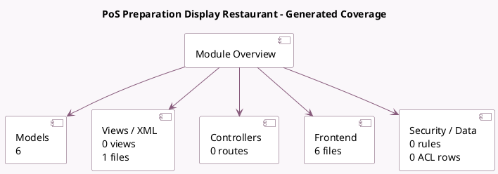

<!-- GENERATED:MODULE -->
---
tags: [odoo, enterprise, module]
---

# PoS Preparation Display Restaurant

- Scope: Enterprise Addons
- Source: enterprise/pos_restaurant_preparation_display
- Dependencies: [[docs/Community Addons/pos_restaurant/pos_restaurant|pos_restaurant]], [[docs/Enterprise Addons/pos_enterprise/pos_enterprise|pos_enterprise]]

## Summary

Display Orders for Preparation stage.

## Generated coverage

- Models: 6
- XML files with UI/data artifacts: 1
- Views: 0
- Actions: 0
- Menus: 1
- Rules (ir.rule): 0
- Access CSV entries: 0
- Controller units: 0
- Frontend asset files: 6

## Module map

## Detail notes

- Models: [[docs/Enterprise Addons/pos_restaurant_preparation_display/Models|Models]] (6)
- Views and XML: [[docs/Enterprise Addons/pos_restaurant_preparation_display/Views|Views]] (1 files)
- Frontend: [[docs/Enterprise Addons/pos_restaurant_preparation_display/Frontend|Frontend]] (6 files)

## Key models

- `pos.config`
- `pos.order`
- `pos.prep.display`
- `pos.prep.order`
- `restaurant.order.course`
- `restaurant.table`

## Navigation

- [[../Enterprise Addons/Enterprise Addons|Back to scope]]
- [[../../docs/docs|Back to docs]]

<!-- GENERATED:MODULE -->

