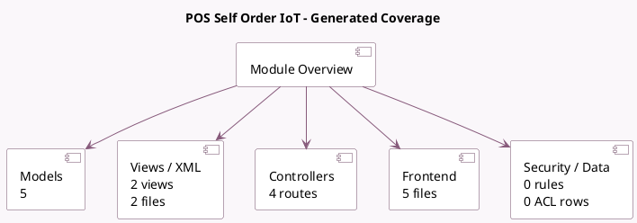

<!-- GENERATED:MODULE -->
---
tags: [odoo, enterprise, module]
---

# POS Self Order IoT

- Scope: Enterprise Addons
- Source: enterprise/pos_self_order_iot
- Dependencies: [[docs/Enterprise Addons/pos_iot/pos_iot|pos_iot]], [[docs/Community Addons/pos_self_order/pos_self_order|pos_self_order]]

## Summary

IoT in PoS Kiosk

## Generated coverage

- Models: 5
- XML files with UI/data artifacts: 2
- Views: 2
- Actions: 0
- Menus: 0
- Rules (ir.rule): 0
- Access CSV entries: 0
- Controller units: 1
- Frontend asset files: 5

## Module map

## Detail notes

- Models: [[docs/Enterprise Addons/pos_self_order_iot/Models|Models]] (5)
- Views and XML: [[docs/Enterprise Addons/pos_self_order_iot/Views|Views]] (2 files)
- Controllers: [[docs/Enterprise Addons/pos_self_order_iot/Controllers|Controllers]] (1)
- Frontend: [[docs/Enterprise Addons/pos_self_order_iot/Frontend|Frontend]] (5 files)

## Key models

- `auto.config.pos.iot`
- `iot.box`
- `pos.config`
- `pos.payment.method`
- `res.config.settings`

## Navigation

- [[../Enterprise Addons/Enterprise Addons|Back to scope]]
- [[../../docs/docs|Back to docs]]

<!-- GENERATED:MODULE -->

