<!-- GENERATED:MODEL -->
---
tags: [odoo, enterprise, generated, model]
---

# account.move

- Module: [[docs/Enterprise Addons/pos_settle_due/pos_settle_due|pos_settle_due]]
- Scope: Enterprise Addons
- Defined in module: extension only
- Source files: `models/account_move.py`
- Python classes: `AccountMove`

## Field footprint

- Detected fields: 2
- Field types: `Monetary` x 1, `One2many` x 1
- Relation fields: 1

## Sample fields

- `pos_amount_unsettled`: `Monetary` (compute `_compute_pos_amount_unsettled`, store `True`)
- `pos_order_line_ids`: `One2many` (comodel `pos.order.line`)

## Method hints

- Detected methods: 3
- Action methods: none
- Compute methods: `_compute_pos_amount_unsettled`
- Onchange methods: none

## Direct relation diagram

```plantuml
@startuml
!define ODOO_COLOR_PRIMARY #714B67
!define ODOO_COLOR_ACCENT #875A7B
!define ODOO_COLOR_BG #FAF7FA

skinparam backgroundColor ODOO_COLOR_BG
skinparam defaultTextAlignment left
skinparam ArrowColor ODOO_COLOR_ACCENT
skinparam ClassBackgroundColor white
skinparam ClassBorderColor ODOO_COLOR_PRIMARY
skinparam ComponentBackgroundColor white
skinparam ComponentBorderColor ODOO_COLOR_PRIMARY
skinparam NoteBackgroundColor #FFF8FF
skinparam NoteBorderColor ODOO_COLOR_ACCENT
skinparam SequenceLifeLineBorderColor ODOO_COLOR_ACCENT
skinparam SequenceLifeLineBackgroundColor #FFFFFF
skinparam SequenceParticipantBorderColor ODOO_COLOR_PRIMARY
skinparam SequenceParticipantBackgroundColor #FFFFFF
skinparam sequence {
  ArrowColor ODOO_COLOR_ACCENT
  ActorBorderColor ODOO_COLOR_PRIMARY
}
title account.move - Direct Relations
class "account.move" as account_move
class "pos.order.line" as pos_order_line
account_move --|> pos_order_line : pos_order_line_ids
@enduml
```

## Navigation

- **Parent:** [[docs/Enterprise Addons/pos_settle_due/Models]]

<!-- GENERATED:MODEL -->
