<!-- GENERATED:MODEL -->
---
tags: [odoo, enterprise, generated, model]
---

# pos.order.line

- Module: [[docs/Enterprise Addons/pos_settle_due/pos_settle_due|pos_settle_due]]
- Scope: Enterprise Addons
- Defined in module: extension only
- Source files: `models/pos_order_line.py`
- Python classes: `PosOrderLine`

## Field footprint

- Detected fields: 2
- Field types: `Many2one` x 2
- Relation fields: 2

## Sample fields

- `settled_invoice_id`: `Many2one` (comodel `account.move`)
- `settled_order_id`: `Many2one` (comodel `pos.order`)

## Method hints

- Detected methods: 3
- Action methods: none
- Compute methods: none
- Onchange methods: none

## Direct relation diagram

```plantuml
@startuml
!define ODOO_COLOR_PRIMARY #714B67
!define ODOO_COLOR_ACCENT #875A7B
!define ODOO_COLOR_BG #FAF7FA

skinparam backgroundColor ODOO_COLOR_BG
skinparam defaultTextAlignment left
skinparam ArrowColor ODOO_COLOR_ACCENT
skinparam ClassBackgroundColor white
skinparam ClassBorderColor ODOO_COLOR_PRIMARY
skinparam ComponentBackgroundColor white
skinparam ComponentBorderColor ODOO_COLOR_PRIMARY
skinparam NoteBackgroundColor #FFF8FF
skinparam NoteBorderColor ODOO_COLOR_ACCENT
skinparam SequenceLifeLineBorderColor ODOO_COLOR_ACCENT
skinparam SequenceLifeLineBackgroundColor #FFFFFF
skinparam SequenceParticipantBorderColor ODOO_COLOR_PRIMARY
skinparam SequenceParticipantBackgroundColor #FFFFFF
skinparam sequence {
  ArrowColor ODOO_COLOR_ACCENT
  ActorBorderColor ODOO_COLOR_PRIMARY
}
title pos.order.line - Direct Relations
class "pos.order.line" as pos_order_line
class "account.move" as account_move
class "pos.order" as pos_order
pos_order_line --> pos_order : settled_order_id
pos_order_line --> account_move : settled_invoice_id
@enduml
```

## Navigation

- **Parent:** [[docs/Enterprise Addons/pos_settle_due/Models]]

<!-- GENERATED:MODEL -->
