<!-- GENERATED:MODEL -->
---
tags: [odoo, enterprise, generated, model]
---

# pos.order

- Module: [[docs/Enterprise Addons/pos_settle_due/pos_settle_due|pos_settle_due]]
- Scope: Enterprise Addons
- Defined in module: extension only
- Source files: `models/pos_order.py`
- Python classes: `PosOrder`

## Field footprint

- Detected fields: 5
- Field types: `Integer` x 1, `Many2one` x 1, `Monetary` x 2, `One2many` x 1
- Relation fields: 2

## Sample fields

- `commercial_partner_id`: `Many2one` (comodel `res.partner`, related `partner_id.commercial_partner_id`, store `True`)
- `customer_due_total`: `Monetary` (compute `_compute_customer_due_total`, store `True`)
- `init_customer_due_total`: `Monetary`
- `settled_order_line_ids`: `One2many` (comodel `pos.order.line`)
- `settled_orders_count`: `Integer` (compute `_compute_settled_orders_count`, store `True`)

## Method hints

- Detected methods: 3
- Action methods: `action_view_settled_orders`
- Compute methods: `_compute_customer_due_total`, `_compute_settled_orders_count`
- Onchange methods: none

## Direct relation diagram

```plantuml
@startuml
!define ODOO_COLOR_PRIMARY #714B67
!define ODOO_COLOR_ACCENT #875A7B
!define ODOO_COLOR_BG #FAF7FA

skinparam backgroundColor ODOO_COLOR_BG
skinparam defaultTextAlignment left
skinparam ArrowColor ODOO_COLOR_ACCENT
skinparam ClassBackgroundColor white
skinparam ClassBorderColor ODOO_COLOR_PRIMARY
skinparam ComponentBackgroundColor white
skinparam ComponentBorderColor ODOO_COLOR_PRIMARY
skinparam NoteBackgroundColor #FFF8FF
skinparam NoteBorderColor ODOO_COLOR_ACCENT
skinparam SequenceLifeLineBorderColor ODOO_COLOR_ACCENT
skinparam SequenceLifeLineBackgroundColor #FFFFFF
skinparam SequenceParticipantBorderColor ODOO_COLOR_PRIMARY
skinparam SequenceParticipantBackgroundColor #FFFFFF
skinparam sequence {
  ArrowColor ODOO_COLOR_ACCENT
  ActorBorderColor ODOO_COLOR_PRIMARY
}
title pos.order - Direct Relations
class "pos.order" as pos_order
class "pos.order.line" as pos_order_line
class "res.partner" as res_partner
pos_order --|> pos_order_line : settled_order_line_ids
pos_order --> res_partner : commercial_partner_id
@enduml
```

## Navigation

- **Parent:** [[docs/Enterprise Addons/pos_settle_due/Models]]

<!-- GENERATED:MODEL -->
