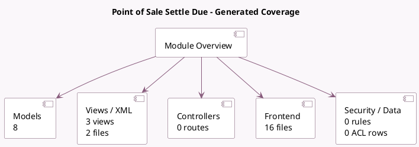

<!-- GENERATED:MODULE -->
---
tags: [odoo, enterprise, module]
---

# Point of Sale Settle Due

- Scope: Enterprise Addons
- Source: enterprise/pos_settle_due
- Dependencies: [[docs/Community Addons/point_of_sale/point_of_sale|point_of_sale]], [[docs/Enterprise Addons/account_followup/account_followup|account_followup]]

## Summary

Settle partner's due in the POS UI.

## Generated coverage

- Models: 8
- XML files with UI/data artifacts: 2
- Views: 3
- Actions: 0
- Menus: 0
- Rules (ir.rule): 0
- Access CSV entries: 0
- Controller units: 0
- Frontend asset files: 16

## Module map

## Detail notes

- Models: [[docs/Enterprise Addons/pos_settle_due/Models|Models]] (8)
- Views and XML: [[docs/Enterprise Addons/pos_settle_due/Views|Views]] (2 files)
- Frontend: [[docs/Enterprise Addons/pos_settle_due/Frontend|Frontend]] (16 files)

## Key models

- `account.move`
- `ir.ui.view`
- `pos.config`
- `pos.order`
- `pos.order.line`
- `pos.session`
- `res.company`
- `res.partner`

## Navigation

- [[../Enterprise Addons/Enterprise Addons|Back to scope]]
- [[../../docs/docs|Back to docs]]

<!-- GENERATED:MODULE -->

