<!-- GENERATED:MODEL -->
---
tags: [odoo, enterprise, generated, model]
---

# pos.payment.method

- Module: [[docs/Enterprise Addons/pos_tyro/pos_tyro|pos_tyro]]
- Scope: Enterprise Addons
- Defined in module: extension only
- Source files: `models/pos_payment_method.py`
- Python classes: `PosPaymentMethod`

## Field footprint

- Detected fields: 7
- Field types: `Boolean` x 2, `Char` x 3, `Many2one` x 1, `Selection` x 1
- Relation fields: 1

## Sample fields

- `tyro_always_print_merchant_receipt`: `Boolean` (comodel `Always print merchant receipts`)
- `tyro_integrated_receipts`: `Boolean` (comodel `Integrated Receipts`)
- `tyro_integration_key`: `Char` (comodel `Integration Key`)
- `tyro_merchant_id`: `Char` (comodel `Tyro Merchant ID`)
- `tyro_mode`: `Selection`
- `tyro_surcharge_product_id`: `Many2one` (comodel `product.product`)
- `tyro_terminal_id`: `Char` (comodel `Tyro Terminal ID`)

## Method hints

- Detected methods: 6
- Action methods: `action_get_tyro_report`, `action_pair_tyro_terminal`
- Compute methods: none
- Onchange methods: none

## Direct relation diagram

```plantuml
@startuml
!define ODOO_COLOR_PRIMARY #714B67
!define ODOO_COLOR_ACCENT #875A7B
!define ODOO_COLOR_BG #FAF7FA

skinparam backgroundColor ODOO_COLOR_BG
skinparam defaultTextAlignment left
skinparam ArrowColor ODOO_COLOR_ACCENT
skinparam ClassBackgroundColor white
skinparam ClassBorderColor ODOO_COLOR_PRIMARY
skinparam ComponentBackgroundColor white
skinparam ComponentBorderColor ODOO_COLOR_PRIMARY
skinparam NoteBackgroundColor #FFF8FF
skinparam NoteBorderColor ODOO_COLOR_ACCENT
skinparam SequenceLifeLineBorderColor ODOO_COLOR_ACCENT
skinparam SequenceLifeLineBackgroundColor #FFFFFF
skinparam SequenceParticipantBorderColor ODOO_COLOR_PRIMARY
skinparam SequenceParticipantBackgroundColor #FFFFFF
skinparam sequence {
  ArrowColor ODOO_COLOR_ACCENT
  ActorBorderColor ODOO_COLOR_PRIMARY
}
title pos.payment.method - Direct Relations
class "pos.payment.method" as pos_payment_method
class "product.product" as product_product
pos_payment_method --> product_product : tyro_surcharge_product_id
@enduml
```

## Navigation

- **Parent:** [[docs/Enterprise Addons/pos_tyro/Models]]

<!-- GENERATED:MODEL -->
