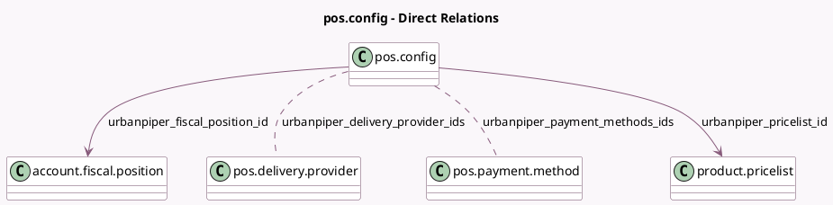

<!-- GENERATED:MODEL -->
---
tags: [odoo, enterprise, generated, model]
---

# pos.config

- Module: [[docs/Enterprise Addons/pos_urban_piper/pos_urban_piper|pos_urban_piper]]
- Scope: Enterprise Addons
- Defined in module: extension only
- Source files: `models/pos_config.py`
- Python classes: `PosConfig`

## Field footprint

- Detected fields: 8
- Field types: `Char` x 3, `Datetime` x 1, `Many2many` x 2, `Many2one` x 2
- Relation fields: 4

## Sample fields

- `name`: `Char`
- `urbanpiper_delivery_provider_ids`: `Many2many` (comodel `pos.delivery.provider`)
- `urbanpiper_fiscal_position_id`: `Many2one` (comodel `account.fiscal.position`)
- `urbanpiper_last_sync_date`: `Datetime`
- `urbanpiper_payment_methods_ids`: `Many2many` (comodel `pos.payment.method`)
- `urbanpiper_pricelist_id`: `Many2one` (comodel `product.pricelist`)
- `urbanpiper_store_identifier`: `Char`
- `urbanpiper_webhook_url`: `Char`

## Method hints

- Detected methods: 29
- Action methods: none
- Compute methods: none
- Onchange methods: none

## Direct relation diagram

## Navigation

- **Parent:** [[docs/Enterprise Addons/pos_urban_piper/Models]]

<!-- GENERATED:MODEL -->
