<!-- GENERATED:MODEL -->
---
tags: [odoo, enterprise, generated, model]
---

# pos.delivery.provider

- Module: [[docs/Enterprise Addons/pos_urban_piper/pos_urban_piper|pos_urban_piper]]
- Scope: Enterprise Addons
- Defined in module: yes
- Source files: `models/pos_delivery_provider.py`
- Python classes: `PosDeliveryProvider`
- Description: Online Delivery Providers
- Inherits: `pos.load.mixin`

## Field footprint

- Detected fields: 5
- Field types: `Char` x 3, `Image` x 1, `Many2many` x 1
- Relation fields: 1

## Sample fields

- `available_country_ids`: `Many2many` (comodel `res.country`)
- `image_128`: `Image`
- `journal_code`: `Char`
- `name`: `Char`
- `technical_name`: `Char`

## Method hints

- Detected methods: 2
- Action methods: none
- Compute methods: none
- Onchange methods: none

## Direct relation diagram

```plantuml
@startuml
!define ODOO_COLOR_PRIMARY #714B67
!define ODOO_COLOR_ACCENT #875A7B
!define ODOO_COLOR_BG #FAF7FA

skinparam backgroundColor ODOO_COLOR_BG
skinparam defaultTextAlignment left
skinparam ArrowColor ODOO_COLOR_ACCENT
skinparam ClassBackgroundColor white
skinparam ClassBorderColor ODOO_COLOR_PRIMARY
skinparam ComponentBackgroundColor white
skinparam ComponentBorderColor ODOO_COLOR_PRIMARY
skinparam NoteBackgroundColor #FFF8FF
skinparam NoteBorderColor ODOO_COLOR_ACCENT
skinparam SequenceLifeLineBorderColor ODOO_COLOR_ACCENT
skinparam SequenceLifeLineBackgroundColor #FFFFFF
skinparam SequenceParticipantBorderColor ODOO_COLOR_PRIMARY
skinparam SequenceParticipantBackgroundColor #FFFFFF
skinparam sequence {
  ArrowColor ODOO_COLOR_ACCENT
  ActorBorderColor ODOO_COLOR_PRIMARY
}
title pos.delivery.provider - Direct Relations
class "pos.delivery.provider" as pos_delivery_provider
class "res.country" as res_country
pos_delivery_provider .. res_country : available_country_ids
@enduml
```

## Navigation

- **Parent:** [[docs/Enterprise Addons/pos_urban_piper/Models]]

<!-- GENERATED:MODEL -->
