<!-- GENERATED:MODEL -->
---
tags: [odoo, enterprise, generated, model]
---

# pos.urbanpiper.test.order.wizard

- Module: [[docs/Enterprise Addons/pos_urban_piper/pos_urban_piper|pos_urban_piper]]
- Scope: Enterprise Addons
- Defined in module: yes
- Source files: `wizard/pos_urban_piper_test_order.py`
- Python classes: `UrbanPiperTestOrderWizard`
- Description: Urbanpiper test order wizard

## Field footprint

- Detected fields: 7
- Field types: `Char` x 1, `Integer` x 4, `Many2one` x 2
- Relation fields: 2

## Sample fields

- `delivery_charge`: `Integer`
- `delivery_instruction`: `Char`
- `delivery_provider_id`: `Many2one` (comodel `pos.delivery.provider`)
- `discount_amount`: `Integer`
- `packaging_charge`: `Integer`
- `product_id`: `Many2one` (comodel `product.template`)
- `quantity`: `Integer`

## Method hints

- Detected methods: 3
- Action methods: none
- Compute methods: none
- Onchange methods: none

## Direct relation diagram

```plantuml
@startuml
!define ODOO_COLOR_PRIMARY #714B67
!define ODOO_COLOR_ACCENT #875A7B
!define ODOO_COLOR_BG #FAF7FA

skinparam backgroundColor ODOO_COLOR_BG
skinparam defaultTextAlignment left
skinparam ArrowColor ODOO_COLOR_ACCENT
skinparam ClassBackgroundColor white
skinparam ClassBorderColor ODOO_COLOR_PRIMARY
skinparam ComponentBackgroundColor white
skinparam ComponentBorderColor ODOO_COLOR_PRIMARY
skinparam NoteBackgroundColor #FFF8FF
skinparam NoteBorderColor ODOO_COLOR_ACCENT
skinparam SequenceLifeLineBorderColor ODOO_COLOR_ACCENT
skinparam SequenceLifeLineBackgroundColor #FFFFFF
skinparam SequenceParticipantBorderColor ODOO_COLOR_PRIMARY
skinparam SequenceParticipantBackgroundColor #FFFFFF
skinparam sequence {
  ArrowColor ODOO_COLOR_ACCENT
  ActorBorderColor ODOO_COLOR_PRIMARY
}
title pos.urbanpiper.test.order.wizard - Direct Relations
class "pos.urbanpiper.test.order.wizard" as pos_urbanpiper_test_order_wizard
class "pos.delivery.provider" as pos_delivery_provider
class "product.template" as product_template
pos_urbanpiper_test_order_wizard --> product_template : product_id
pos_urbanpiper_test_order_wizard --> pos_delivery_provider : delivery_provider_id
@enduml
```

## Navigation

- **Parent:** [[docs/Enterprise Addons/pos_urban_piper/Models]]

<!-- GENERATED:MODEL -->
