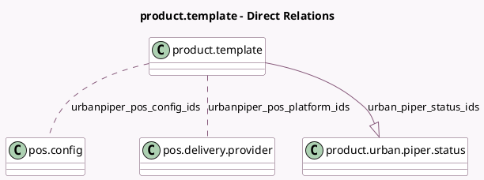

<!-- GENERATED:MODEL -->
---
tags: [odoo, enterprise, generated, model]
---

# product.template

- Module: [[docs/Enterprise Addons/pos_urban_piper/pos_urban_piper|pos_urban_piper]]
- Scope: Enterprise Addons
- Defined in module: extension only
- Source files: `models/product.py`
- Python classes: `ProductTemplate`

## Field footprint

- Detected fields: 6
- Field types: `Boolean` x 2, `Many2many` x 2, `One2many` x 1, `Selection` x 1
- Relation fields: 3

## Sample fields

- `is_alcoholic_on_urbanpiper`: `Boolean`
- `is_recommended_on_urbanpiper`: `Boolean`
- `urban_piper_status_ids`: `One2many` (comodel `product.urban.piper.status`)
- `urbanpiper_meal_type`: `Selection`
- `urbanpiper_pos_config_ids`: `Many2many` (comodel `pos.config`)
- `urbanpiper_pos_platform_ids`: `Many2many` (comodel `pos.delivery.provider`, compute `_compute_urbanpiper_pos_platform_ids`, store `True`)

## Method hints

- Detected methods: 5
- Action methods: none
- Compute methods: `_compute_urbanpiper_pos_platform_ids`
- Onchange methods: none

## Direct relation diagram

## Navigation

- **Parent:** [[docs/Enterprise Addons/pos_urban_piper/Models]]

<!-- GENERATED:MODEL -->
