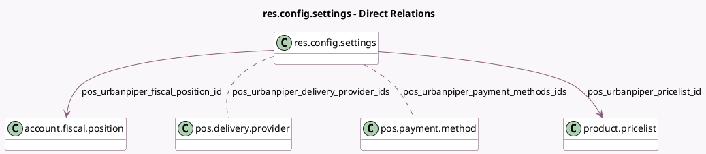

<!-- GENERATED:MODEL -->
---
tags: [odoo, enterprise, generated, model]
---

# res.config.settings

- Module: [[docs/Enterprise Addons/pos_urban_piper/pos_urban_piper|pos_urban_piper]]
- Scope: Enterprise Addons
- Defined in module: extension only
- Source files: `models/res_config_settings.py`
- Python classes: `ResConfigSettings`

## Field footprint

- Detected fields: 9
- Field types: `Char` x 4, `Datetime` x 1, `Many2many` x 2, `Many2one` x 2
- Relation fields: 4

## Sample fields

- `pos_urbanpiper_delivery_provider_ids`: `Many2many` (comodel `pos.delivery.provider`, related `pos_config_id.urbanpiper_delivery_provider_ids`)
- `pos_urbanpiper_fiscal_position_id`: `Many2one` (comodel `account.fiscal.position`, related `pos_config_id.urbanpiper_fiscal_position_id`)
- `pos_urbanpiper_last_sync_date`: `Datetime` (related `pos_config_id.urbanpiper_last_sync_date`)
- `pos_urbanpiper_payment_methods_ids`: `Many2many` (comodel `pos.payment.method`, related `pos_config_id.urbanpiper_payment_methods_ids`)
- `pos_urbanpiper_pricelist_id`: `Many2one` (comodel `product.pricelist`, related `pos_config_id.urbanpiper_pricelist_id`)
- `pos_urbanpiper_store_identifier`: `Char` (related `pos_config_id.urbanpiper_store_identifier`)
- `pos_urbanpiper_webhook_url`: `Char` (related `pos_config_id.urbanpiper_webhook_url`)
- `urbanpiper_apikey`: `Char` (related `company_id.pos_urbanpiper_apikey`)
- `urbanpiper_username`: `Char` (related `company_id.pos_urbanpiper_username`)

## Method hints

- Detected methods: 5
- Action methods: `action_flush_and_sync_menu`, `action_refresh_webhooks`
- Compute methods: none
- Onchange methods: none

## Direct relation diagram

## Navigation

- **Parent:** [[docs/Enterprise Addons/pos_urban_piper/Models]]

<!-- GENERATED:MODEL -->
