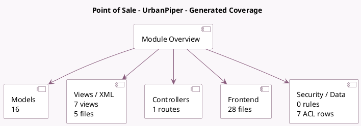

<!-- GENERATED:MODULE -->
---
tags: [odoo, enterprise, module]
---

# Point of Sale - UrbanPiper

- Scope: Enterprise Addons
- Source: enterprise/pos_urban_piper
- Dependencies: [[docs/Enterprise Addons/pos_enterprise/pos_enterprise|pos_enterprise]], [[docs/Community Addons/pos_discount/pos_discount|pos_discount]]

## Generated coverage

- Models: 16
- XML files with UI/data artifacts: 5
- Views: 7
- Actions: 0
- Menus: 0
- Rules (ir.rule): 0
- Access CSV entries: 7
- Controller units: 1
- Frontend asset files: 28

## Module map

## Detail notes

- Models: [[docs/Enterprise Addons/pos_urban_piper/Models|Models]] (16)
- Views and XML: [[docs/Enterprise Addons/pos_urban_piper/Views|Views]] (5 files)
- Controllers: [[docs/Enterprise Addons/pos_urban_piper/Controllers|Controllers]] (1)
- Frontend: [[docs/Enterprise Addons/pos_urban_piper/Frontend|Frontend]] (28 files)

## Key models

- `ir.config_parameter`
- `pos.category`
- `pos.config`
- `pos.delivery.provider`
- `pos.order`
- `pos.payment`
- `pos.payment.method`
- `pos.prep.display`
- `pos.prep.order`
- `pos.session`
- `pos.urbanpiper.test.order.wizard`
- `product.pricelist`

## Navigation

- [[../Enterprise Addons/Enterprise Addons|Back to scope]]
- [[../../docs/docs|Back to docs]]

<!-- GENERATED:MODULE -->

