<!-- GENERATED:MODEL -->
---
tags: [odoo, enterprise, generated, model]
---

# pos.store.timing

- Module: [[docs/Enterprise Addons/pos_urban_piper_enhancements/pos_urban_piper_enhancements|pos_urban_piper_enhancements]]
- Scope: Enterprise Addons
- Defined in module: yes
- Source files: `models/pos_store_timing.py`
- Python classes: `PosStoreTiming`
- Description: Pos Store Timings

## Field footprint

- Detected fields: 4
- Field types: `Float` x 2, `Many2many` x 1, `Selection` x 1
- Relation fields: 1

## Sample fields

- `config_ids`: `Many2many` (comodel `pos.config`)
- `end_hour`: `Float` (comodel `Ending Hour`)
- `start_hour`: `Float` (comodel `Starting Hour`)
- `weekday`: `Selection`

## Method hints

- Detected methods: 0
- Action methods: none
- Compute methods: none
- Onchange methods: none

## Direct relation diagram

```plantuml
@startuml
!define ODOO_COLOR_PRIMARY #714B67
!define ODOO_COLOR_ACCENT #875A7B
!define ODOO_COLOR_BG #FAF7FA

skinparam backgroundColor ODOO_COLOR_BG
skinparam defaultTextAlignment left
skinparam ArrowColor ODOO_COLOR_ACCENT
skinparam ClassBackgroundColor white
skinparam ClassBorderColor ODOO_COLOR_PRIMARY
skinparam ComponentBackgroundColor white
skinparam ComponentBorderColor ODOO_COLOR_PRIMARY
skinparam NoteBackgroundColor #FFF8FF
skinparam NoteBorderColor ODOO_COLOR_ACCENT
skinparam SequenceLifeLineBorderColor ODOO_COLOR_ACCENT
skinparam SequenceLifeLineBackgroundColor #FFFFFF
skinparam SequenceParticipantBorderColor ODOO_COLOR_PRIMARY
skinparam SequenceParticipantBackgroundColor #FFFFFF
skinparam sequence {
  ArrowColor ODOO_COLOR_ACCENT
  ActorBorderColor ODOO_COLOR_PRIMARY
}
title pos.store.timing - Direct Relations
class "pos.store.timing" as pos_store_timing
class "pos.config" as pos_config
pos_store_timing .. pos_config : config_ids
@enduml
```

## Navigation

- **Parent:** [[docs/Enterprise Addons/pos_urban_piper_enhancements/Models]]

<!-- GENERATED:MODEL -->
