<!-- GENERATED:MODEL -->
---
tags: [odoo, enterprise, generated, model]
---

# product.template.attribute.value

- Module: [[docs/Enterprise Addons/pos_urban_piper_enhancements/pos_urban_piper_enhancements|pos_urban_piper_enhancements]]
- Scope: Enterprise Addons
- Defined in module: extension only
- Source files: `models/product_template_attribuite_value.py`
- Python classes: `ProductTemplateAttributeValue`

## Field footprint

- Detected fields: 1
- Field types: `Many2many` x 1
- Relation fields: 1

## Sample fields

- `urbanpiper_pos_config_ids`: `Many2many` (comodel `pos.config`)

## Method hints

- Detected methods: 1
- Action methods: none
- Compute methods: none
- Onchange methods: none

## Direct relation diagram

```plantuml
@startuml
!define ODOO_COLOR_PRIMARY #714B67
!define ODOO_COLOR_ACCENT #875A7B
!define ODOO_COLOR_BG #FAF7FA

skinparam backgroundColor ODOO_COLOR_BG
skinparam defaultTextAlignment left
skinparam ArrowColor ODOO_COLOR_ACCENT
skinparam ClassBackgroundColor white
skinparam ClassBorderColor ODOO_COLOR_PRIMARY
skinparam ComponentBackgroundColor white
skinparam ComponentBorderColor ODOO_COLOR_PRIMARY
skinparam NoteBackgroundColor #FFF8FF
skinparam NoteBorderColor ODOO_COLOR_ACCENT
skinparam SequenceLifeLineBorderColor ODOO_COLOR_ACCENT
skinparam SequenceLifeLineBackgroundColor #FFFFFF
skinparam SequenceParticipantBorderColor ODOO_COLOR_PRIMARY
skinparam SequenceParticipantBackgroundColor #FFFFFF
skinparam sequence {
  ArrowColor ODOO_COLOR_ACCENT
  ActorBorderColor ODOO_COLOR_PRIMARY
}
title product.template.attribute.value - Direct Relations
class "product.template.attribute.value" as product_template_attribute_value
class "pos.config" as pos_config
product_template_attribute_value .. pos_config : urbanpiper_pos_config_ids
@enduml
```

## Navigation

- **Parent:** [[docs/Enterprise Addons/pos_urban_piper_enhancements/Models]]

<!-- GENERATED:MODEL -->
