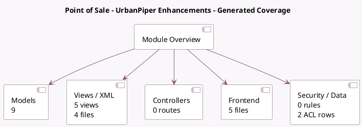

<!-- GENERATED:MODULE -->
---
tags: [odoo, enterprise, module]
---

# Point of Sale - UrbanPiper Enhancements

- Scope: Enterprise Addons
- Source: enterprise/pos_urban_piper_enhancements
- Dependencies: [[docs/Enterprise Addons/pos_urban_piper/pos_urban_piper|pos_urban_piper]]

## Generated coverage

- Models: 9
- XML files with UI/data artifacts: 4
- Views: 5
- Actions: 1
- Menus: 2
- Rules (ir.rule): 0
- Access CSV entries: 2
- Controller units: 0
- Frontend asset files: 5

## Module map

## Detail notes

- Models: [[docs/Enterprise Addons/pos_urban_piper_enhancements/Models|Models]] (9)
- Views and XML: [[docs/Enterprise Addons/pos_urban_piper_enhancements/Views|Views]] (4 files)
- Frontend: [[docs/Enterprise Addons/pos_urban_piper_enhancements/Frontend|Frontend]] (5 files)

## Key models

- `pos.config`
- `pos.order`
- `pos.prep.order`
- `pos.session`
- `pos.store.timing`
- `product.template`
- `product.template.attribute.value`
- `res.config.settings`
- `res.partner`

## Navigation

- [[../Enterprise Addons/Enterprise Addons|Back to scope]]
- [[../../docs/docs|Back to docs]]

<!-- GENERATED:MODULE -->

