<!-- GENERATED:MODEL -->
---
tags: [odoo, enterprise, generated, model]
---

# product.fetch.image.wizard

- Module: [[docs/Enterprise Addons/product_barcodelookup/product_barcodelookup|product_barcodelookup]]
- Scope: Enterprise Addons
- Defined in module: yes
- Source files: `wizard/product_fetch_image_wizard.py`
- Python classes: `ProductFetchImageWizard`
- Description: Fetch product images from Barcode Lookup based on the product's barcode.

## Field footprint

- Detected fields: 4
- Field types: `Integer` x 3, `Many2many` x 1
- Relation fields: 1

## Sample fields

- `nb_products_selected`: `Integer`
- `nb_products_to_process`: `Integer`
- `nb_products_unable_to_process`: `Integer`
- `products_to_process`: `Many2many` (comodel `product.product`)

## Method hints

- Detected methods: 10
- Action methods: `action_fetch_image`
- Compute methods: none
- Onchange methods: none

## Direct relation diagram

```plantuml
@startuml
!define ODOO_COLOR_PRIMARY #714B67
!define ODOO_COLOR_ACCENT #875A7B
!define ODOO_COLOR_BG #FAF7FA

skinparam backgroundColor ODOO_COLOR_BG
skinparam defaultTextAlignment left
skinparam ArrowColor ODOO_COLOR_ACCENT
skinparam ClassBackgroundColor white
skinparam ClassBorderColor ODOO_COLOR_PRIMARY
skinparam ComponentBackgroundColor white
skinparam ComponentBorderColor ODOO_COLOR_PRIMARY
skinparam NoteBackgroundColor #FFF8FF
skinparam NoteBorderColor ODOO_COLOR_ACCENT
skinparam SequenceLifeLineBorderColor ODOO_COLOR_ACCENT
skinparam SequenceLifeLineBackgroundColor #FFFFFF
skinparam SequenceParticipantBorderColor ODOO_COLOR_PRIMARY
skinparam SequenceParticipantBackgroundColor #FFFFFF
skinparam sequence {
  ArrowColor ODOO_COLOR_ACCENT
  ActorBorderColor ODOO_COLOR_PRIMARY
}
title product.fetch.image.wizard - Direct Relations
class "product.fetch.image.wizard" as product_fetch_image_wizard
class "product.product" as product_product
product_fetch_image_wizard .. product_product : products_to_process
@enduml
```

## Navigation

- **Parent:** [[docs/Enterprise Addons/product_barcodelookup/Models]]

<!-- GENERATED:MODEL -->
