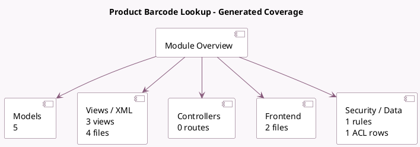

<!-- GENERATED:MODULE -->
---
tags: [odoo, enterprise, module]
---

# Product Barcode Lookup

- Scope: Enterprise Addons
- Source: enterprise/product_barcodelookup
- Dependencies: [[docs/Community Addons/product/product|product]]

## Generated coverage

- Models: 5
- XML files with UI/data artifacts: 4
- Views: 3
- Actions: 2
- Menus: 0
- Rules (ir.rule): 1
- Access CSV entries: 1
- Controller units: 0
- Frontend asset files: 2

## Module map

## Detail notes

- Models: [[docs/Enterprise Addons/product_barcodelookup/Models|Models]] (5)
- Views and XML: [[docs/Enterprise Addons/product_barcodelookup/Views|Views]] (4 files)
- Frontend: [[docs/Enterprise Addons/product_barcodelookup/Frontend|Frontend]] (2 files)

## Key models

- `ir.cron.trigger`
- `product.fetch.image.wizard`
- `product.product`
- `product.template`
- `res.config.settings`

## Navigation

- [[../Enterprise Addons/Enterprise Addons|Back to scope]]
- [[../../docs/docs|Back to docs]]

<!-- GENERATED:MODULE -->

