<!-- GENERATED:MODEL -->
---
tags: [odoo, enterprise, generated, model]
---

# project.task

- Module: [[docs/Enterprise Addons/project_enterprise/project_enterprise|project_enterprise]]
- Scope: Enterprise Addons
- Defined in module: extension only
- Source files: `models/project_task.py`
- Python classes: `ProjectTask`

## Field footprint

- Detected fields: 10
- Field types: `Boolean` x 1, `Char` x 1, `Datetime` x 2, `Float` x 1, `Html` x 2, `Many2many` x 1, `Many2one` x 2
- Relation fields: 3

## Sample fields

- `allocated_hours`: `Float` (compute `_compute_allocated_hours`, store `True`)
- `dependency_warning`: `Html` (compute `_compute_dependency_warning`)
- `display_warning_dependency_in_gantt`: `Boolean` (compute `_compute_display_warning_dependency_in_gantt`)
- `partner_id`: `Many2one`
- `planned_date_begin`: `Datetime` (comodel `Start date`)
- `planned_date_start`: `Datetime` (compute `_compute_planned_date_start`)
- `planning_overlap`: `Html` (compute `_compute_planning_overlap`)
- `project_id`: `Many2one`
- `user_ids`: `Many2many`
- `user_names`: `Char` (compute `_compute_user_names`)

## Method hints

- Detected methods: 64
- Action methods: `action_dependent_tasks`, `action_fsm_view_overlapping_tasks`, `action_recurring_tasks`, `action_rollback_auto_scheduling`, `action_unschedule_task`
- Compute methods: `_compute_allocated_hours`, `_compute_dependency_warning`, `_compute_display_warning_dependency_in_gantt`, `_compute_planned_date_start`, `_compute_planning_overlap`, `_compute_schedule`, `_compute_user_names`
- Onchange methods: `_onchange_planned_dates`

## Direct relation diagram

```plantuml
@startuml
!define ODOO_COLOR_PRIMARY #714B67
!define ODOO_COLOR_ACCENT #875A7B
!define ODOO_COLOR_BG #FAF7FA

skinparam backgroundColor ODOO_COLOR_BG
skinparam defaultTextAlignment left
skinparam ArrowColor ODOO_COLOR_ACCENT
skinparam ClassBackgroundColor white
skinparam ClassBorderColor ODOO_COLOR_PRIMARY
skinparam ComponentBackgroundColor white
skinparam ComponentBorderColor ODOO_COLOR_PRIMARY
skinparam NoteBackgroundColor #FFF8FF
skinparam NoteBorderColor ODOO_COLOR_ACCENT
skinparam SequenceLifeLineBorderColor ODOO_COLOR_ACCENT
skinparam SequenceLifeLineBackgroundColor #FFFFFF
skinparam SequenceParticipantBorderColor ODOO_COLOR_PRIMARY
skinparam SequenceParticipantBackgroundColor #FFFFFF
skinparam sequence {
  ArrowColor ODOO_COLOR_ACCENT
  ActorBorderColor ODOO_COLOR_PRIMARY
}
title project.task - Direct Relations
class "project.task" as project_task
@enduml
```

## Navigation

- **Parent:** [[docs/Enterprise Addons/project_enterprise/Models]]

<!-- GENERATED:MODEL -->
