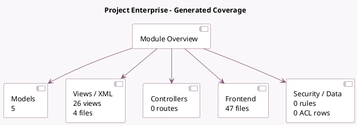

<!-- GENERATED:MODULE -->
---
tags: [odoo, enterprise, module]
---

# Project Enterprise

- Scope: Enterprise Addons
- Source: enterprise/project_enterprise
- Dependencies: [[docs/Community Addons/project/project|project]], [[docs/Enterprise Addons/web_map/web_map|web_map]], [[docs/Enterprise Addons/web_gantt/web_gantt|web_gantt]], [[docs/Enterprise Addons/web_enterprise/web_enterprise|web_enterprise]]

## Summary

Bridge module for project and enterprise

## Generated coverage

- Models: 5
- XML files with UI/data artifacts: 4
- Views: 26
- Actions: 21
- Menus: 0
- Rules (ir.rule): 0
- Access CSV entries: 0
- Controller units: 0
- Frontend asset files: 47

## Module map

## Detail notes

- Models: [[docs/Enterprise Addons/project_enterprise/Models|Models]] (5)
- Views and XML: [[docs/Enterprise Addons/project_enterprise/Views|Views]] (4 files)
- Frontend: [[docs/Enterprise Addons/project_enterprise/Frontend|Frontend]] (47 files)

## Key models

- `project.project`
- `project.task`
- `project.task.recurrence`
- `report.project.task.user`
- `res.users`

## Navigation

- [[../Enterprise Addons/Enterprise Addons|Back to scope]]
- [[../../docs/docs|Back to docs]]

<!-- GENERATED:MODULE -->

