<!-- GENERATED:MODEL -->
---
tags: [odoo, enterprise, generated, model]
---

# planning.slot.template

- Module: [[docs/Enterprise Addons/project_forecast/project_forecast|project_forecast]]
- Scope: Enterprise Addons
- Defined in module: extension only
- Source files: `models/planning_slot_template.py`
- Python classes: `PlanningSlotTemplate`

## Field footprint

- Detected fields: 2
- Field types: `Many2one` x 2
- Relation fields: 2

## Sample fields

- `company_id`: `Many2one` (comodel `res.company`, related `project_id.company_id`)
- `project_id`: `Many2one` (comodel `project.project`)

## Method hints

- Detected methods: 1
- Action methods: none
- Compute methods: `_compute_display_name`
- Onchange methods: none

## Direct relation diagram

```plantuml
@startuml
!define ODOO_COLOR_PRIMARY #714B67
!define ODOO_COLOR_ACCENT #875A7B
!define ODOO_COLOR_BG #FAF7FA

skinparam backgroundColor ODOO_COLOR_BG
skinparam defaultTextAlignment left
skinparam ArrowColor ODOO_COLOR_ACCENT
skinparam ClassBackgroundColor white
skinparam ClassBorderColor ODOO_COLOR_PRIMARY
skinparam ComponentBackgroundColor white
skinparam ComponentBorderColor ODOO_COLOR_PRIMARY
skinparam NoteBackgroundColor #FFF8FF
skinparam NoteBorderColor ODOO_COLOR_ACCENT
skinparam SequenceLifeLineBorderColor ODOO_COLOR_ACCENT
skinparam SequenceLifeLineBackgroundColor #FFFFFF
skinparam SequenceParticipantBorderColor ODOO_COLOR_PRIMARY
skinparam SequenceParticipantBackgroundColor #FFFFFF
skinparam sequence {
  ArrowColor ODOO_COLOR_ACCENT
  ActorBorderColor ODOO_COLOR_PRIMARY
}
title planning.slot.template - Direct Relations
class "planning.slot.template" as planning_slot_template
class "project.project" as project_project
class "res.company" as res_company
planning_slot_template --> project_project : project_id
planning_slot_template --> res_company : company_id
@enduml
```

## Navigation

- **Parent:** [[docs/Enterprise Addons/project_forecast/Models]]

<!-- GENERATED:MODEL -->
