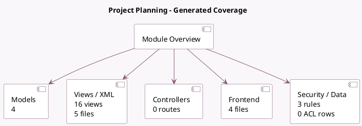

<!-- GENERATED:MODULE -->
---
tags: [odoo, enterprise, module]
---

# Project Planning

- Scope: Enterprise Addons
- Source: enterprise/project_forecast
- Dependencies: [[docs/Community Addons/project/project|project]], [[docs/Enterprise Addons/planning/planning|planning]], [[docs/Enterprise Addons/web_grid/web_grid|web_grid]]

## Summary

Plan your resources on project tasks

## Generated coverage

- Models: 4
- XML files with UI/data artifacts: 5
- Views: 16
- Actions: 23
- Menus: 2
- Rules (ir.rule): 3
- Access CSV entries: 0
- Controller units: 0
- Frontend asset files: 4

## Module map

## Detail notes

- Models: [[docs/Enterprise Addons/project_forecast/Models|Models]] (4)
- Views and XML: [[docs/Enterprise Addons/project_forecast/Views|Views]] (5 files)
- Frontend: [[docs/Enterprise Addons/project_forecast/Frontend|Frontend]] (4 files)

## Key models

- `planning.analysis.report`
- `planning.slot`
- `planning.slot.template`
- `project.project`

## Navigation

- [[../Enterprise Addons/Enterprise Addons|Back to scope]]
- [[../../docs/docs|Back to docs]]

<!-- GENERATED:MODULE -->

