<!-- GENERATED:MODEL -->
---
tags: [odoo, enterprise, generated, model]
---

# helpdesk.ticket.convert.wizard

- Module: [[docs/Enterprise Addons/project_helpdesk/project_helpdesk|project_helpdesk]]
- Scope: Enterprise Addons
- Defined in module: yes
- Source files: `wizard/helpdesk_ticket_convert_wizard.py`
- Python classes: `HelpdeskTicketConvertWizard`
- Description: Convert Helpdesk Tickets to Tasks

## Field footprint

- Detected fields: 2
- Field types: `Many2one` x 2
- Relation fields: 2

## Sample fields

- `project_id`: `Many2one` (comodel `project.project`)
- `stage_id`: `Many2one` (comodel `project.task.type`, compute `_compute_default_stage`, store `True`)

## Method hints

- Detected methods: 6
- Action methods: `action_convert`
- Compute methods: `_compute_default_stage`
- Onchange methods: none

## Direct relation diagram

```plantuml
@startuml
!define ODOO_COLOR_PRIMARY #714B67
!define ODOO_COLOR_ACCENT #875A7B
!define ODOO_COLOR_BG #FAF7FA

skinparam backgroundColor ODOO_COLOR_BG
skinparam defaultTextAlignment left
skinparam ArrowColor ODOO_COLOR_ACCENT
skinparam ClassBackgroundColor white
skinparam ClassBorderColor ODOO_COLOR_PRIMARY
skinparam ComponentBackgroundColor white
skinparam ComponentBorderColor ODOO_COLOR_PRIMARY
skinparam NoteBackgroundColor #FFF8FF
skinparam NoteBorderColor ODOO_COLOR_ACCENT
skinparam SequenceLifeLineBorderColor ODOO_COLOR_ACCENT
skinparam SequenceLifeLineBackgroundColor #FFFFFF
skinparam SequenceParticipantBorderColor ODOO_COLOR_PRIMARY
skinparam SequenceParticipantBackgroundColor #FFFFFF
skinparam sequence {
  ArrowColor ODOO_COLOR_ACCENT
  ActorBorderColor ODOO_COLOR_PRIMARY
}
title helpdesk.ticket.convert.wizard - Direct Relations
class "helpdesk.ticket.convert.wizard" as helpdesk_ticket_convert_wizard
class "project.project" as project_project
class "project.task.type" as project_task_type
helpdesk_ticket_convert_wizard --> project_project : project_id
helpdesk_ticket_convert_wizard --> project_task_type : stage_id
@enduml
```

## Navigation

- **Parent:** [[docs/Enterprise Addons/project_helpdesk/Models]]

<!-- GENERATED:MODEL -->
