<!-- GENERATED:MODEL -->
---
tags: [odoo, enterprise, generated, model]
---

# project.task.convert.wizard

- Module: [[docs/Enterprise Addons/project_helpdesk/project_helpdesk|project_helpdesk]]
- Scope: Enterprise Addons
- Defined in module: yes
- Source files: `wizard/project_task_convert_wizard.py`
- Python classes: `ProjectTaskConvertWizard`
- Description: Convert Project Tasks to Tickets

## Field footprint

- Detected fields: 2
- Field types: `Many2one` x 2
- Relation fields: 2

## Sample fields

- `stage_id`: `Many2one` (comodel `helpdesk.stage`, compute `_compute_default_stage`, store `True`)
- `team_id`: `Many2one` (comodel `helpdesk.team`)

## Method hints

- Detected methods: 6
- Action methods: `action_convert`
- Compute methods: `_compute_default_stage`
- Onchange methods: none

## Direct relation diagram

```plantuml
@startuml
!define ODOO_COLOR_PRIMARY #714B67
!define ODOO_COLOR_ACCENT #875A7B
!define ODOO_COLOR_BG #FAF7FA

skinparam backgroundColor ODOO_COLOR_BG
skinparam defaultTextAlignment left
skinparam ArrowColor ODOO_COLOR_ACCENT
skinparam ClassBackgroundColor white
skinparam ClassBorderColor ODOO_COLOR_PRIMARY
skinparam ComponentBackgroundColor white
skinparam ComponentBorderColor ODOO_COLOR_PRIMARY
skinparam NoteBackgroundColor #FFF8FF
skinparam NoteBorderColor ODOO_COLOR_ACCENT
skinparam SequenceLifeLineBorderColor ODOO_COLOR_ACCENT
skinparam SequenceLifeLineBackgroundColor #FFFFFF
skinparam SequenceParticipantBorderColor ODOO_COLOR_PRIMARY
skinparam SequenceParticipantBackgroundColor #FFFFFF
skinparam sequence {
  ArrowColor ODOO_COLOR_ACCENT
  ActorBorderColor ODOO_COLOR_PRIMARY
}
title project.task.convert.wizard - Direct Relations
class "project.task.convert.wizard" as project_task_convert_wizard
class "helpdesk.stage" as helpdesk_stage
class "helpdesk.team" as helpdesk_team
project_task_convert_wizard --> helpdesk_team : team_id
project_task_convert_wizard --> helpdesk_stage : stage_id
@enduml
```

## Navigation

- **Parent:** [[docs/Enterprise Addons/project_helpdesk/Models]]

<!-- GENERATED:MODEL -->
