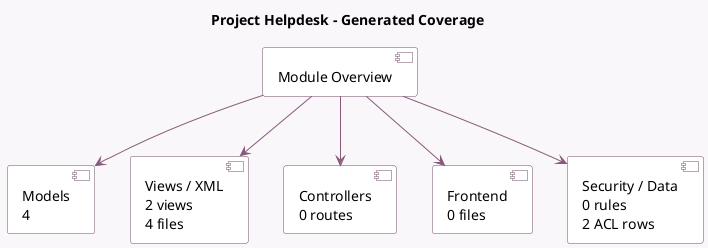

<!-- GENERATED:MODULE -->
---
tags: [odoo, enterprise, module]
---

# Project Helpdesk

- Scope: Enterprise Addons
- Source: enterprise/project_helpdesk
- Dependencies: [[docs/Enterprise Addons/project_enterprise/project_enterprise|project_enterprise]], [[docs/Enterprise Addons/helpdesk/helpdesk|helpdesk]]

## Summary

Project helpdesk

## Generated coverage

- Models: 4
- XML files with UI/data artifacts: 4
- Views: 2
- Actions: 2
- Menus: 0
- Rules (ir.rule): 0
- Access CSV entries: 2
- Controller units: 0
- Frontend asset files: 0

## Module map

## Detail notes

- Models: [[docs/Enterprise Addons/project_helpdesk/Models|Models]] (4)
- Views and XML: [[docs/Enterprise Addons/project_helpdesk/Views|Views]] (4 files)

## Key models

- `helpdesk.ticket`
- `helpdesk.ticket.convert.wizard`
- `project.task`
- `project.task.convert.wizard`

## Navigation

- [[../Enterprise Addons/Enterprise Addons|Back to scope]]
- [[../../docs/docs|Back to docs]]

<!-- GENERATED:MODULE -->

