<!-- GENERATED:MODEL -->
---
tags: [odoo, enterprise, generated, model]
---

# planning.slot

- Module: [[docs/Enterprise Addons/project_timesheet_forecast/project_timesheet_forecast|project_timesheet_forecast]]
- Scope: Enterprise Addons
- Defined in module: extension only
- Source files: `models/planning_slot.py`
- Python classes: `PlanningSlot`

## Field footprint

- Detected fields: 6
- Field types: `Boolean` x 3, `Float` x 2, `Many2many` x 1
- Relation fields: 1

## Sample fields

- `allow_timesheets`: `Boolean` (comodel `Allow timesheets`, related `project_id.allow_timesheets`)
- `can_open_timesheets`: `Boolean` (compute `_compute_can_open_timesheet`)
- `effective_hours`: `Float` (comodel `Effective Time`, compute `_compute_effective_hours`, store `True`)
- `encode_uom_in_days`: `Boolean` (compute `_compute_encode_uom_in_days`)
- `percentage_hours`: `Float` (comodel `Progress`, compute `_compute_percentage_hours`, store `True`)
- `timesheet_ids`: `Many2many` (comodel `account.analytic.line`, compute `_compute_timesheet_ids`)

## Method hints

- Detected methods: 10
- Action methods: `action_open_timesheets`
- Compute methods: `_compute_can_open_timesheet`, `_compute_effective_hours`, `_compute_encode_uom_in_days`, `_compute_percentage_hours`, `_compute_timesheet_ids`
- Onchange methods: none

## Direct relation diagram

```plantuml
@startuml
!define ODOO_COLOR_PRIMARY #714B67
!define ODOO_COLOR_ACCENT #875A7B
!define ODOO_COLOR_BG #FAF7FA

skinparam backgroundColor ODOO_COLOR_BG
skinparam defaultTextAlignment left
skinparam ArrowColor ODOO_COLOR_ACCENT
skinparam ClassBackgroundColor white
skinparam ClassBorderColor ODOO_COLOR_PRIMARY
skinparam ComponentBackgroundColor white
skinparam ComponentBorderColor ODOO_COLOR_PRIMARY
skinparam NoteBackgroundColor #FFF8FF
skinparam NoteBorderColor ODOO_COLOR_ACCENT
skinparam SequenceLifeLineBorderColor ODOO_COLOR_ACCENT
skinparam SequenceLifeLineBackgroundColor #FFFFFF
skinparam SequenceParticipantBorderColor ODOO_COLOR_PRIMARY
skinparam SequenceParticipantBackgroundColor #FFFFFF
skinparam sequence {
  ArrowColor ODOO_COLOR_ACCENT
  ActorBorderColor ODOO_COLOR_PRIMARY
}
title planning.slot - Direct Relations
class "planning.slot" as planning_slot
class "account.analytic.line" as account_analytic_line
planning_slot .. account_analytic_line : timesheet_ids
@enduml
```

## Navigation

- **Parent:** [[docs/Enterprise Addons/project_timesheet_forecast/Models]]

<!-- GENERATED:MODEL -->
