<!-- GENERATED:MODEL -->
---
tags: [odoo, enterprise, generated, model]
---

# project.timesheet.forecast.report.analysis

- Module: [[docs/Enterprise Addons/project_timesheet_forecast/project_timesheet_forecast|project_timesheet_forecast]]
- Scope: Enterprise Addons
- Defined in module: yes
- Source files: `report/project_timesheet_forecast_report_analysis.py`
- Python classes: `ProjectTimesheetForecastReportAnalysis`
- Description: Planning / Timesheets Analysis

## Field footprint

- Detected fields: 12
- Field types: `Boolean` x 1, `Date` x 1, `Float` x 5, `Many2one` x 4, `Selection` x 1
- Relation fields: 4

## Sample fields

- `company_id`: `Many2one` (comodel `res.company`)
- `difference`: `Float` (comodel `Time Remaining`)
- `effective_costs`: `Float` (comodel `Effective Costs`)
- `effective_hours`: `Float` (comodel `Effective Time`)
- `employee_id`: `Many2one` (comodel `hr.employee`)
- `entry_date`: `Date` (comodel `Date`)
- `is_published`: `Boolean`
- `line_type`: `Selection`
- `planned_costs`: `Float` (comodel `Planned Costs`)
- `planned_hours`: `Float` (comodel `Planned Time`)
- `project_id`: `Many2one` (comodel `project.project`)
- `user_id`: `Many2one` (comodel `res.users`)

## Method hints

- Detected methods: 10
- Action methods: none
- Compute methods: none
- Onchange methods: none

## Direct relation diagram

```plantuml
@startuml
!define ODOO_COLOR_PRIMARY #714B67
!define ODOO_COLOR_ACCENT #875A7B
!define ODOO_COLOR_BG #FAF7FA

skinparam backgroundColor ODOO_COLOR_BG
skinparam defaultTextAlignment left
skinparam ArrowColor ODOO_COLOR_ACCENT
skinparam ClassBackgroundColor white
skinparam ClassBorderColor ODOO_COLOR_PRIMARY
skinparam ComponentBackgroundColor white
skinparam ComponentBorderColor ODOO_COLOR_PRIMARY
skinparam NoteBackgroundColor #FFF8FF
skinparam NoteBorderColor ODOO_COLOR_ACCENT
skinparam SequenceLifeLineBorderColor ODOO_COLOR_ACCENT
skinparam SequenceLifeLineBackgroundColor #FFFFFF
skinparam SequenceParticipantBorderColor ODOO_COLOR_PRIMARY
skinparam SequenceParticipantBackgroundColor #FFFFFF
skinparam sequence {
  ArrowColor ODOO_COLOR_ACCENT
  ActorBorderColor ODOO_COLOR_PRIMARY
}
title project.timesheet.forecast.report.analysis - Direct Relations
class "project.timesheet.forecast.report.analysis" as project_timesheet_forecast_report_analysis
class "hr.employee" as hr_employee
class "project.project" as project_project
class "res.company" as res_company
class "res.users" as res_users
project_timesheet_forecast_report_analysis --> hr_employee : employee_id
project_timesheet_forecast_report_analysis --> res_company : company_id
project_timesheet_forecast_report_analysis --> project_project : project_id
project_timesheet_forecast_report_analysis --> res_users : user_id
@enduml
```

## Navigation

- **Parent:** [[docs/Enterprise Addons/project_timesheet_forecast/Models]]

<!-- GENERATED:MODEL -->
