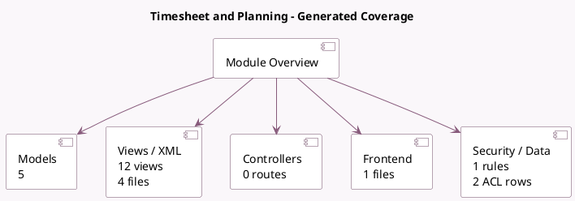

<!-- GENERATED:MODULE -->
---
tags: [odoo, enterprise, module]
---

# Timesheet and Planning

- Scope: Enterprise Addons
- Source: enterprise/project_timesheet_forecast
- Dependencies: [[docs/Enterprise Addons/timesheet_grid/timesheet_grid|timesheet_grid]], [[docs/Enterprise Addons/project_forecast/project_forecast|project_forecast]]

## Summary

Compare timesheets and plannings

## Generated coverage

- Models: 5
- XML files with UI/data artifacts: 4
- Views: 12
- Actions: 8
- Menus: 2
- Rules (ir.rule): 1
- Access CSV entries: 2
- Controller units: 0
- Frontend asset files: 1

## Module map

## Detail notes

- Models: [[docs/Enterprise Addons/project_timesheet_forecast/Models|Models]] (5)
- Views and XML: [[docs/Enterprise Addons/project_timesheet_forecast/Views|Views]] (4 files)
- Frontend: [[docs/Enterprise Addons/project_timesheet_forecast/Frontend|Frontend]] (1 files)

## Key models

- `ir.ui.menu`
- `planning.analysis.report`
- `planning.slot`
- `project.project`
- `project.timesheet.forecast.report.analysis`

## Navigation

- [[../Enterprise Addons/Enterprise Addons|Back to scope]]
- [[../../docs/docs|Back to docs]]

<!-- GENERATED:MODULE -->

