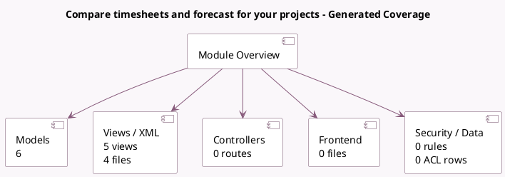

<!-- GENERATED:MODULE -->
---
tags: [odoo, enterprise, module]
---

# Compare timesheets and forecast for your projects

- Scope: Enterprise Addons
- Source: enterprise/project_timesheet_forecast_sale
- Dependencies: [[docs/Enterprise Addons/project_timesheet_forecast/project_timesheet_forecast|project_timesheet_forecast]], [[docs/Community Addons/sale_timesheet/sale_timesheet|sale_timesheet]], [[docs/Enterprise Addons/sale_project_forecast/sale_project_forecast|sale_project_forecast]]

## Generated coverage

- Models: 6
- XML files with UI/data artifacts: 4
- Views: 5
- Actions: 1
- Menus: 0
- Rules (ir.rule): 0
- Access CSV entries: 0
- Controller units: 0
- Frontend asset files: 0

## Module map

## Detail notes

- Models: [[docs/Enterprise Addons/project_timesheet_forecast_sale/Models|Models]] (6)
- Views and XML: [[docs/Enterprise Addons/project_timesheet_forecast_sale/Views|Views]] (4 files)

## Key models

- `account.analytic.line`
- `planning.analysis.report`
- `planning.slot`
- `project.project`
- `project.timesheet.forecast.report.analysis`
- `sale.order.line`

## Navigation

- [[../Enterprise Addons/Enterprise Addons|Back to scope]]
- [[../../docs/docs|Back to docs]]

<!-- GENERATED:MODULE -->

