<!-- GENERATED:MODEL -->
---
tags: [odoo, enterprise, generated, model]
---

# purchase.order.line

- Module: [[docs/Enterprise Addons/purchase_accountant/purchase_accountant|purchase_accountant]]
- Scope: Enterprise Addons
- Defined in module: extension only
- Source files: `models/purchase_order_line.py`
- Python classes: `PurchaseOrderLine`

## Field footprint

- Detected fields: 3
- Field types: `Boolean` x 2, `Many2one` x 1
- Relation fields: 1

## Sample fields

- `bill_to_receive`: `Boolean` (store `False`)
- `prepaid_expense`: `Boolean` (store `False`)
- `product_categ_id`: `Many2one` (related `product_id.categ_id`)

## Method hints

- Detected methods: 5
- Action methods: none
- Compute methods: none
- Onchange methods: none

## Direct relation diagram

```plantuml
@startuml
!define ODOO_COLOR_PRIMARY #714B67
!define ODOO_COLOR_ACCENT #875A7B
!define ODOO_COLOR_BG #FAF7FA

skinparam backgroundColor ODOO_COLOR_BG
skinparam defaultTextAlignment left
skinparam ArrowColor ODOO_COLOR_ACCENT
skinparam ClassBackgroundColor white
skinparam ClassBorderColor ODOO_COLOR_PRIMARY
skinparam ComponentBackgroundColor white
skinparam ComponentBorderColor ODOO_COLOR_PRIMARY
skinparam NoteBackgroundColor #FFF8FF
skinparam NoteBorderColor ODOO_COLOR_ACCENT
skinparam SequenceLifeLineBorderColor ODOO_COLOR_ACCENT
skinparam SequenceLifeLineBackgroundColor #FFFFFF
skinparam SequenceParticipantBorderColor ODOO_COLOR_PRIMARY
skinparam SequenceParticipantBackgroundColor #FFFFFF
skinparam sequence {
  ArrowColor ODOO_COLOR_ACCENT
  ActorBorderColor ODOO_COLOR_PRIMARY
}
title purchase.order.line - Direct Relations
class "purchase.order.line" as purchase_order_line
@enduml
```

## Navigation

- **Parent:** [[docs/Enterprise Addons/purchase_accountant/Models]]

<!-- GENERATED:MODEL -->
