<!-- GENERATED:MODEL -->
---
tags: [odoo, enterprise, generated, model]
---

# quality.alert

- Module: [[docs/Enterprise Addons/quality/quality|quality]]
- Scope: Enterprise Addons
- Defined in module: yes
- Source files: `models/quality.py`
- Python classes: `QualityAlert`
- Description: Quality Alert
- Inherits: `mail.activity.mixin`, `mail.thread.cc`

## Field footprint

- Detected fields: 19
- Field types: `Char` x 1, `Datetime` x 2, `Html` x 3, `Many2many` x 2, `Many2one` x 10, `Selection` x 1
- Relation fields: 12

## Sample fields

- `action_corrective`: `Html` (comodel `Corrective Action`)
- `action_preventive`: `Html` (comodel `Preventive Action`)
- `check_id`: `Many2one` (comodel `quality.check`)
- `company_id`: `Many2one` (comodel `res.company`)
- `date_assign`: `Datetime` (comodel `Date Assigned`)
- `date_close`: `Datetime` (comodel `Date Closed`)
- `description`: `Html` (comodel `Description`)
- `lot_ids`: `Many2many` (comodel `stock.lot`)
- `name`: `Char` (comodel `Name`)
- `partner_id`: `Many2one` (comodel `res.partner`)
- `picking_id`: `Many2one` (comodel `stock.picking`)
- `priority`: `Selection`
- `product_id`: `Many2one` (comodel `product.product`)
- `product_tmpl_id`: `Many2one` (comodel `product.template`)
- `reason_id`: `Many2one` (comodel `quality.reason`)
- `stage_id`: `Many2one` (comodel `quality.alert.stage`)
- `tag_ids`: `Many2many` (comodel `quality.tag`)
- `team_id`: `Many2one` (comodel `quality.alert.team`)
- `user_id`: `Many2one` (comodel `res.users`)

## Method hints

- Detected methods: 7
- Action methods: none
- Compute methods: none
- Onchange methods: `onchange_product_tmpl_id`, `onchange_team_id`

## Direct relation diagram

```plantuml
@startuml
!define ODOO_COLOR_PRIMARY #714B67
!define ODOO_COLOR_ACCENT #875A7B
!define ODOO_COLOR_BG #FAF7FA

skinparam backgroundColor ODOO_COLOR_BG
skinparam defaultTextAlignment left
skinparam ArrowColor ODOO_COLOR_ACCENT
skinparam ClassBackgroundColor white
skinparam ClassBorderColor ODOO_COLOR_PRIMARY
skinparam ComponentBackgroundColor white
skinparam ComponentBorderColor ODOO_COLOR_PRIMARY
skinparam NoteBackgroundColor #FFF8FF
skinparam NoteBorderColor ODOO_COLOR_ACCENT
skinparam SequenceLifeLineBorderColor ODOO_COLOR_ACCENT
skinparam SequenceLifeLineBackgroundColor #FFFFFF
skinparam SequenceParticipantBorderColor ODOO_COLOR_PRIMARY
skinparam SequenceParticipantBackgroundColor #FFFFFF
skinparam sequence {
  ArrowColor ODOO_COLOR_ACCENT
  ActorBorderColor ODOO_COLOR_PRIMARY
}
title quality.alert - Direct Relations
class "quality.alert" as quality_alert
class "product.product" as product_product
class "product.template" as product_template
class "quality.alert.stage" as quality_alert_stage
class "quality.alert.team" as quality_alert_team
class "quality.check" as quality_check
class "quality.reason" as quality_reason
class "quality.tag" as quality_tag
class "res.company" as res_company
class "res.partner" as res_partner
class "res.users" as res_users
class "stock.lot" as stock_lot
class "stock.picking" as stock_picking
quality_alert --> quality_alert_stage : stage_id
quality_alert --> res_company : company_id
quality_alert --> quality_reason : reason_id
quality_alert .. quality_tag : tag_ids
quality_alert --> stock_picking : picking_id
quality_alert --> res_users : user_id
quality_alert --> quality_alert_team : team_id
quality_alert --> res_partner : partner_id
quality_alert --> quality_check : check_id
quality_alert --> product_template : product_tmpl_id
quality_alert --> product_product : product_id
quality_alert .. stock_lot : lot_ids
@enduml
```

## Navigation

- **Parent:** [[docs/Enterprise Addons/quality/Models]]

<!-- GENERATED:MODEL -->
