<!-- GENERATED:MODEL -->
---
tags: [odoo, enterprise, generated, model]
---

# quality.alert.team

- Module: [[docs/Enterprise Addons/quality/quality|quality]]
- Scope: Enterprise Addons
- Defined in module: yes
- Source files: `models/quality.py`
- Python classes: `QualityAlertTeam`
- Description: Quality Alert Team
- Inherits: `mail.alias.mixin`, `mail.thread`

## Field footprint

- Detected fields: 6
- Field types: `Char` x 1, `Integer` x 4, `Many2one` x 1
- Relation fields: 1

## Sample fields

- `alert_count`: `Integer` (comodel `# Quality Alerts`, compute `_compute_alert_count`)
- `check_count`: `Integer` (comodel `# Quality Checks`, compute `_compute_check_count`)
- `color`: `Integer` (comodel `Color`)
- `company_id`: `Many2one` (comodel `res.company`)
- `name`: `Char` (comodel `Name`)
- `sequence`: `Integer` (comodel `Sequence`)

## Method hints

- Detected methods: 4
- Action methods: none
- Compute methods: `_compute_alert_count`, `_compute_check_count`
- Onchange methods: none

## Direct relation diagram

```plantuml
@startuml
!define ODOO_COLOR_PRIMARY #714B67
!define ODOO_COLOR_ACCENT #875A7B
!define ODOO_COLOR_BG #FAF7FA

skinparam backgroundColor ODOO_COLOR_BG
skinparam defaultTextAlignment left
skinparam ArrowColor ODOO_COLOR_ACCENT
skinparam ClassBackgroundColor white
skinparam ClassBorderColor ODOO_COLOR_PRIMARY
skinparam ComponentBackgroundColor white
skinparam ComponentBorderColor ODOO_COLOR_PRIMARY
skinparam NoteBackgroundColor #FFF8FF
skinparam NoteBorderColor ODOO_COLOR_ACCENT
skinparam SequenceLifeLineBorderColor ODOO_COLOR_ACCENT
skinparam SequenceLifeLineBackgroundColor #FFFFFF
skinparam SequenceParticipantBorderColor ODOO_COLOR_PRIMARY
skinparam SequenceParticipantBackgroundColor #FFFFFF
skinparam sequence {
  ArrowColor ODOO_COLOR_ACCENT
  ActorBorderColor ODOO_COLOR_PRIMARY
}
title quality.alert.team - Direct Relations
class "quality.alert.team" as quality_alert_team
class "res.company" as res_company
quality_alert_team --> res_company : company_id
@enduml
```

## Navigation

- **Parent:** [[docs/Enterprise Addons/quality/Models]]

<!-- GENERATED:MODEL -->
