<!-- GENERATED:MODEL -->
---
tags: [odoo, enterprise, generated, model]
---

# quality.check

- Module: [[docs/Enterprise Addons/quality/quality|quality]]
- Scope: Enterprise Addons
- Defined in module: yes
- Source files: `models/quality.py`
- Python classes: `QualityCheck`
- Description: Quality Check
- Inherits: `mail.activity.mixin`, `mail.thread`

## Field footprint

- Detected fields: 20
- Field types: `Binary` x 1, `Char` x 3, `Datetime` x 1, `Html` x 1, `Integer` x 1, `Many2many` x 1, `Many2one` x 9, `One2many` x 1, `Selection` x 1, `Text` x 1
- Relation fields: 11

## Sample fields

- `additional_note`: `Text` (comodel `Additional Note`)
- `alert_count`: `Integer` (comodel `# Quality Alerts`, compute `_compute_alert_count`)
- `alert_ids`: `One2many` (comodel `quality.alert`)
- `company_id`: `Many2one` (comodel `res.company`)
- `control_date`: `Datetime` (comodel `Control Date`)
- `failure_location_id`: `Many2one` (comodel `stock.location`)
- `lot_ids`: `Many2many` (comodel `stock.lot`)
- `name`: `Char` (comodel `Reference`)
- `note`: `Html` (comodel `Note`, compute `_compute_note`, store `True`)
- `partner_id`: `Many2one` (related `picking_id.partner_id`)
- `picking_id`: `Many2one` (comodel `stock.picking`)
- `picture`: `Binary` (comodel `Picture`)
- `point_id`: `Many2one` (comodel `quality.point`)
- `product_id`: `Many2one` (comodel `product.product`)
- `quality_state`: `Selection`
- `team_id`: `Many2one` (comodel `quality.alert.team`, compute `_compute_team_id`, store `True`)
- `test_type`: `Char` (related `test_type_id.technical_name`)
- `test_type_id`: `Many2one` (comodel `quality.point.test_type`, compute `_compute_test_type_id`, store `True`)
- `title`: `Char` (comodel `Title`, compute `_compute_title`, store `True`)
- `user_id`: `Many2one` (comodel `res.users`)

## Method hints

- Detected methods: 13
- Action methods: none
- Compute methods: `_compute_alert_count`, `_compute_note`, `_compute_team_id`, `_compute_test_type_id`, `_compute_title`
- Onchange methods: none

## Direct relation diagram

```plantuml
@startuml
!define ODOO_COLOR_PRIMARY #714B67
!define ODOO_COLOR_ACCENT #875A7B
!define ODOO_COLOR_BG #FAF7FA

skinparam backgroundColor ODOO_COLOR_BG
skinparam defaultTextAlignment left
skinparam ArrowColor ODOO_COLOR_ACCENT
skinparam ClassBackgroundColor white
skinparam ClassBorderColor ODOO_COLOR_PRIMARY
skinparam ComponentBackgroundColor white
skinparam ComponentBorderColor ODOO_COLOR_PRIMARY
skinparam NoteBackgroundColor #FFF8FF
skinparam NoteBorderColor ODOO_COLOR_ACCENT
skinparam SequenceLifeLineBorderColor ODOO_COLOR_ACCENT
skinparam SequenceLifeLineBackgroundColor #FFFFFF
skinparam SequenceParticipantBorderColor ODOO_COLOR_PRIMARY
skinparam SequenceParticipantBackgroundColor #FFFFFF
skinparam sequence {
  ArrowColor ODOO_COLOR_ACCENT
  ActorBorderColor ODOO_COLOR_PRIMARY
}
title quality.check - Direct Relations
class "quality.check" as quality_check
class "product.product" as product_product
class "quality.alert" as quality_alert
class "quality.alert.team" as quality_alert_team
class "quality.point" as quality_point
class "quality.point.test_type" as quality_point_test_type
class "res.company" as res_company
class "res.users" as res_users
class "stock.location" as stock_location
class "stock.lot" as stock_lot
class "stock.picking" as stock_picking
quality_check --> quality_point : point_id
quality_check --> product_product : product_id
quality_check --> stock_picking : picking_id
quality_check .. stock_lot : lot_ids
quality_check --> res_users : user_id
quality_check --> quality_alert_team : team_id
quality_check --> res_company : company_id
quality_check --|> quality_alert : alert_ids
quality_check --> quality_point_test_type : test_type_id
quality_check --> stock_location : failure_location_id
@enduml
```

## Navigation

- **Parent:** [[docs/Enterprise Addons/quality/Models]]

<!-- GENERATED:MODEL -->
