<!-- GENERATED:MODEL -->
---
tags: [odoo, enterprise, generated, model]
---

# quality.point

- Module: [[docs/Enterprise Addons/quality/quality|quality]]
- Scope: Enterprise Addons
- Defined in module: yes
- Source files: `models/quality.py`
- Python classes: `QualityPoint`
- Description: Quality Control Point
- Inherits: `mail.thread`

## Field footprint

- Detected fields: 18
- Field types: `Boolean` x 2, `Char` x 3, `Html` x 2, `Integer` x 2, `Many2many` x 4, `Many2one` x 4, `One2many` x 1
- Relation fields: 9

## Sample fields

- `active`: `Boolean`
- `check_count`: `Integer` (compute `_compute_check_count`)
- `check_ids`: `One2many` (comodel `quality.check`)
- `company_id`: `Many2one` (comodel `res.company`)
- `failure_location_ids`: `Many2many` (comodel `stock.location`)
- `name`: `Char` (comodel `Reference`)
- `note`: `Html` (comodel `Note`)
- `picking_type_ids`: `Many2many` (comodel `stock.picking.type`)
- `product_category_ids`: `Many2many` (comodel `product.category`)
- `product_ids`: `Many2many` (comodel `product.product`)
- `reason`: `Html` (comodel `Cause`)
- `sequence`: `Integer` (comodel `Sequence`)
- `show_failure_location`: `Boolean` (compute `_compute_show_failure_location`)
- `team_id`: `Many2one` (comodel `quality.alert.team`)
- `test_type`: `Char` (related `test_type_id.technical_name`)
- `test_type_id`: `Many2one` (comodel `quality.point.test_type`)
- `title`: `Char` (comodel `Title`)
- `user_id`: `Many2one` (comodel `res.users`)

## Method hints

- Detected methods: 7
- Action methods: none
- Compute methods: `_compute_check_count`, `_compute_show_failure_location`
- Onchange methods: none

## Direct relation diagram

```plantuml
@startuml
!define ODOO_COLOR_PRIMARY #714B67
!define ODOO_COLOR_ACCENT #875A7B
!define ODOO_COLOR_BG #FAF7FA

skinparam backgroundColor ODOO_COLOR_BG
skinparam defaultTextAlignment left
skinparam ArrowColor ODOO_COLOR_ACCENT
skinparam ClassBackgroundColor white
skinparam ClassBorderColor ODOO_COLOR_PRIMARY
skinparam ComponentBackgroundColor white
skinparam ComponentBorderColor ODOO_COLOR_PRIMARY
skinparam NoteBackgroundColor #FFF8FF
skinparam NoteBorderColor ODOO_COLOR_ACCENT
skinparam SequenceLifeLineBorderColor ODOO_COLOR_ACCENT
skinparam SequenceLifeLineBackgroundColor #FFFFFF
skinparam SequenceParticipantBorderColor ODOO_COLOR_PRIMARY
skinparam SequenceParticipantBackgroundColor #FFFFFF
skinparam sequence {
  ArrowColor ODOO_COLOR_ACCENT
  ActorBorderColor ODOO_COLOR_PRIMARY
}
title quality.point - Direct Relations
class "quality.point" as quality_point
class "product.category" as product_category
class "product.product" as product_product
class "quality.alert.team" as quality_alert_team
class "quality.check" as quality_check
class "quality.point.test_type" as quality_point_test_type
class "res.company" as res_company
class "res.users" as res_users
class "stock.location" as stock_location
class "stock.picking.type" as stock_picking_type
quality_point --> quality_alert_team : team_id
quality_point .. product_product : product_ids
quality_point .. product_category : product_category_ids
quality_point .. stock_picking_type : picking_type_ids
quality_point --> res_company : company_id
quality_point --> res_users : user_id
quality_point --|> quality_check : check_ids
quality_point --> quality_point_test_type : test_type_id
quality_point .. stock_location : failure_location_ids
@enduml
```

## Navigation

- **Parent:** [[docs/Enterprise Addons/quality/Models]]

<!-- GENERATED:MODEL -->
