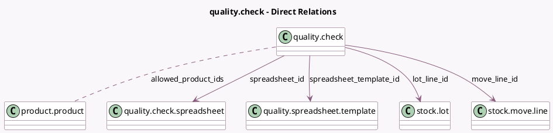

<!-- GENERATED:MODEL -->
---
tags: [odoo, enterprise, generated, model]
---

# quality.check

- Module: [[docs/Enterprise Addons/quality_control/quality_control|quality_control]]
- Scope: Enterprise Addons
- Defined in module: extension only
- Source files: `models/quality.py`
- Python classes: `QualityCheck`

## Field footprint

- Detected fields: 29
- Field types: `Boolean` x 2, `Char` x 2, `Float` x 9, `Html` x 1, `Integer` x 3, `Many2many` x 2, `Many2one` x 6, `Selection` x 3, `Text` x 1
- Relation fields: 8

## Sample fields

- `allowed_product_ids`: `Many2many` (comodel `product.product`, compute `_compute_allowed_product_ids`)
- `failure_message`: `Html` (related `point_id.failure_message`)
- `hide_picking_id`: `Integer` (compute `_compute_hide_picking_id`)
- `hide_production_id`: `Integer` (compute `_compute_hide_production_id`)
- `hide_repair_id`: `Integer` (compute `_compute_hide_repair_id`)
- `is_lot_tested_fractionally`: `Boolean` (related `point_id.is_lot_tested_fractionally`)
- `lot_ids`: `Many2many` (compute `_compute_lot_ids`, store `True`)
- `lot_line_id`: `Many2one` (comodel `stock.lot`, compute `_compute_lot_line_id`, store `True`)
- `lot_name`: `Char` (comodel `Lot/Serial Number Name`, related `move_line_id.lot_name`)
- `measure`: `Float` (comodel `Measure`)
- `measure_on`: `Selection` (compute `_compute_measure_on`, store `True`)
- `measure_success`: `Selection` (compute `_compute_measure_success`, store `True`)
- `move_line_id`: `Many2one` (comodel `stock.move.line`)
- `norm_unit`: `Char` (related `point_id.norm_unit`)
- `product_id`: `Many2one` (compute `_compute_product_id`, store `True`)
- `product_tracking`: `Selection` (related `product_id.tracking`)
- `qty_failed`: `Float` (comodel `Quantity Failed`, compute `_compute_qty_failed`, store `True`)
- `qty_line`: `Float` (compute `_compute_qty_line`)
- `qty_passed`: `Float` (comodel `Quantity Passed`, compute `_compute_qty_passed`, store `True`)
- `qty_tested`: `Float`

## Method hints

- Detected methods: 40
- Action methods: `action_open_quality_check_wizard`, `action_open_spreadsheet`, `action_see_alerts`
- Compute methods: `_compute_allowed_product_ids`, `_compute_hide_picking_id`, `_compute_hide_production_id`, `_compute_hide_repair_id`, `_compute_lot_ids`, `_compute_lot_line_id`, `_compute_measure_on`, `_compute_measure_success`, and 9 more
- Onchange methods: none

## Direct relation diagram

## Navigation

- **Parent:** [[docs/Enterprise Addons/quality_control/Models]]

<!-- GENERATED:MODEL -->
