<!-- GENERATED:MODEL -->
---
tags: [odoo, enterprise, generated, model]
---

# quality.check.wizard

- Module: [[docs/Enterprise Addons/quality_control/quality_control|quality_control]]
- Scope: Enterprise Addons
- Defined in module: yes
- Source files: `wizard/quality_check_wizard.py`
- Python classes: `QualityCheckWizard`
- Description: Wizard for Quality Check Pop Up

## Field footprint

- Detected fields: 31
- Field types: `Binary` x 1, `Boolean` x 3, `Char` x 5, `Float` x 6, `Html` x 2, `Integer` x 2, `Many2many` x 2, `Many2one` x 5, `Selection` x 3, `Text` x 2
- Relation fields: 7

## Sample fields

- `additional_note`: `Text` (related `current_check_id.additional_note`)
- `check_ids`: `Many2many` (comodel `quality.check`)
- `current_check_id`: `Many2one` (comodel `quality.check`)
- `failure_location_id`: `Many2one` (comodel `stock.location`, compute `_compute_failure_location_id`, store `True`)
- `failure_message`: `Html` (related `current_check_id.failure_message`)
- `is_last_check`: `Boolean` (compute `_compute_position`)
- `is_lot_tested_fractionally`: `Boolean` (related `current_check_id.is_lot_tested_fractionally`)
- `lot_line_id`: `Many2one` (related `current_check_id.lot_line_id`)
- `lot_name`: `Char` (related `current_check_id.lot_name`)
- `measure`: `Float` (related `current_check_id.measure`)
- `measure_on`: `Selection` (related `current_check_id.measure_on`)
- `name`: `Char` (related `current_check_id.name`)
- `nb_checks`: `Integer` (compute `_compute_nb_checks`)
- `norm_unit`: `Char` (related `current_check_id.norm_unit`)
- `note`: `Html` (related `current_check_id.note`)
- `picture`: `Binary` (related `current_check_id.picture`)
- `position_current_check`: `Integer` (compute `_compute_position`)
- `potential_failure_location_ids`: `Many2many` (related `current_check_id.point_id.failure_location_ids`)
- `product_id`: `Many2one` (related `current_check_id.product_id`)
- `product_tracking`: `Selection` (related `current_check_id.product_tracking`)

## Method hints

- Detected methods: 13
- Action methods: `action_generate_next_window`, `action_generate_previous_window`, `action_open_spreadsheet`
- Compute methods: `_compute_failure_location_id`, `_compute_nb_checks`, `_compute_position`
- Onchange methods: none

## Direct relation diagram

```plantuml
@startuml
!define ODOO_COLOR_PRIMARY #714B67
!define ODOO_COLOR_ACCENT #875A7B
!define ODOO_COLOR_BG #FAF7FA

skinparam backgroundColor ODOO_COLOR_BG
skinparam defaultTextAlignment left
skinparam ArrowColor ODOO_COLOR_ACCENT
skinparam ClassBackgroundColor white
skinparam ClassBorderColor ODOO_COLOR_PRIMARY
skinparam ComponentBackgroundColor white
skinparam ComponentBorderColor ODOO_COLOR_PRIMARY
skinparam NoteBackgroundColor #FFF8FF
skinparam NoteBorderColor ODOO_COLOR_ACCENT
skinparam SequenceLifeLineBorderColor ODOO_COLOR_ACCENT
skinparam SequenceLifeLineBackgroundColor #FFFFFF
skinparam SequenceParticipantBorderColor ODOO_COLOR_PRIMARY
skinparam SequenceParticipantBackgroundColor #FFFFFF
skinparam sequence {
  ArrowColor ODOO_COLOR_ACCENT
  ActorBorderColor ODOO_COLOR_PRIMARY
}
title quality.check.wizard - Direct Relations
class "quality.check.wizard" as quality_check_wizard
class "quality.check" as quality_check
class "stock.location" as stock_location
quality_check_wizard .. quality_check : check_ids
quality_check_wizard --> quality_check : current_check_id
quality_check_wizard --> stock_location : failure_location_id
@enduml
```

## Navigation

- **Parent:** [[docs/Enterprise Addons/quality_control/Models]]

<!-- GENERATED:MODEL -->
