<!-- GENERATED:MODEL -->
---
tags: [odoo, enterprise, generated, model]
---

# quality.point

- Module: [[docs/Enterprise Addons/quality_control/quality_control|quality_control]]
- Scope: Enterprise Addons
- Defined in module: extension only
- Source files: `models/quality.py`
- Python classes: `QualityPoint`

## Field footprint

- Detected fields: 16
- Field types: `Boolean` x 1, `Char` x 2, `Float` x 7, `Html` x 1, `Integer` x 1, `Many2one` x 1, `Selection` x 3
- Relation fields: 1

## Sample fields

- `average`: `Float` (compute `_compute_standard_deviation_and_average`)
- `failure_message`: `Html` (comodel `Failure Message`)
- `is_lot_tested_fractionally`: `Boolean` (compute `_compute_is_lot_tested_fractionally`)
- `measure_frequency_type`: `Selection`
- `measure_frequency_unit`: `Selection`
- `measure_frequency_unit_value`: `Integer` (comodel `Frequency Unit Value`)
- `measure_frequency_value`: `Float` (comodel `Percentage`)
- `measure_on`: `Selection`
- `norm`: `Float` (comodel `Norm`)
- `norm_unit`: `Char` (comodel `Norm Unit`)
- `spreadsheet_check_cell`: `Char` (related `spreadsheet_template_id.check_cell`)
- `spreadsheet_template_id`: `Many2one` (comodel `quality.spreadsheet.template`)
- `standard_deviation`: `Float` (compute `_compute_standard_deviation_and_average`)
- `testing_percentage_within_lot`: `Float`
- `tolerance_max`: `Float` (comodel `Max Tolerance`)
- `tolerance_min`: `Float` (comodel `Min Tolerance`)

## Method hints

- Detected methods: 10
- Action methods: `action_see_quality_checks`, `action_see_spc_control`
- Compute methods: `_compute_display_name`, `_compute_is_lot_tested_fractionally`, `_compute_standard_deviation_and_average`
- Onchange methods: `onchange_norm`

## Direct relation diagram

```plantuml
@startuml
!define ODOO_COLOR_PRIMARY #714B67
!define ODOO_COLOR_ACCENT #875A7B
!define ODOO_COLOR_BG #FAF7FA

skinparam backgroundColor ODOO_COLOR_BG
skinparam defaultTextAlignment left
skinparam ArrowColor ODOO_COLOR_ACCENT
skinparam ClassBackgroundColor white
skinparam ClassBorderColor ODOO_COLOR_PRIMARY
skinparam ComponentBackgroundColor white
skinparam ComponentBorderColor ODOO_COLOR_PRIMARY
skinparam NoteBackgroundColor #FFF8FF
skinparam NoteBorderColor ODOO_COLOR_ACCENT
skinparam SequenceLifeLineBorderColor ODOO_COLOR_ACCENT
skinparam SequenceLifeLineBackgroundColor #FFFFFF
skinparam SequenceParticipantBorderColor ODOO_COLOR_PRIMARY
skinparam SequenceParticipantBackgroundColor #FFFFFF
skinparam sequence {
  ArrowColor ODOO_COLOR_ACCENT
  ActorBorderColor ODOO_COLOR_PRIMARY
}
title quality.point - Direct Relations
class "quality.point" as quality_point
class "quality.spreadsheet.template" as quality_spreadsheet_template
quality_point --> quality_spreadsheet_template : spreadsheet_template_id
@enduml
```

## Navigation

- **Parent:** [[docs/Enterprise Addons/quality_control/Models]]

<!-- GENERATED:MODEL -->
