<!-- GENERATED:MODEL -->
---
tags: [odoo, enterprise, generated, model]
---

# quality.spreadsheet.template

- Module: [[docs/Enterprise Addons/quality_control/quality_control|quality_control]]
- Scope: Enterprise Addons
- Defined in module: yes
- Source files: `models/quality_spreadsheet_template.py`
- Python classes: `QualitySpreadsheetTemplate`
- Description: Quality check template spreadsheet
- Inherits: `spreadsheet.mixin`

## Field footprint

- Detected fields: 3
- Field types: `Char` x 2, `Many2one` x 1
- Relation fields: 1

## Sample fields

- `check_cell`: `Char`
- `company_id`: `Many2one` (comodel `res.company`)
- `name`: `Char`

## Method hints

- Detected methods: 3
- Action methods: `action_open_spreadsheet`
- Compute methods: none
- Onchange methods: none

## Direct relation diagram

```plantuml
@startuml
!define ODOO_COLOR_PRIMARY #714B67
!define ODOO_COLOR_ACCENT #875A7B
!define ODOO_COLOR_BG #FAF7FA

skinparam backgroundColor ODOO_COLOR_BG
skinparam defaultTextAlignment left
skinparam ArrowColor ODOO_COLOR_ACCENT
skinparam ClassBackgroundColor white
skinparam ClassBorderColor ODOO_COLOR_PRIMARY
skinparam ComponentBackgroundColor white
skinparam ComponentBorderColor ODOO_COLOR_PRIMARY
skinparam NoteBackgroundColor #FFF8FF
skinparam NoteBorderColor ODOO_COLOR_ACCENT
skinparam SequenceLifeLineBorderColor ODOO_COLOR_ACCENT
skinparam SequenceLifeLineBackgroundColor #FFFFFF
skinparam SequenceParticipantBorderColor ODOO_COLOR_PRIMARY
skinparam SequenceParticipantBackgroundColor #FFFFFF
skinparam sequence {
  ArrowColor ODOO_COLOR_ACCENT
  ActorBorderColor ODOO_COLOR_PRIMARY
}
title quality.spreadsheet.template - Direct Relations
class "quality.spreadsheet.template" as quality_spreadsheet_template
class "res.company" as res_company
quality_spreadsheet_template --> res_company : company_id
@enduml
```

## Navigation

- **Parent:** [[docs/Enterprise Addons/quality_control/Models]]

<!-- GENERATED:MODEL -->
