<!-- GENERATED:MODEL -->
---
tags: [odoo, enterprise, generated, model]
---

# stock.move.line

- Module: [[docs/Enterprise Addons/quality_control/quality_control|quality_control]]
- Scope: Enterprise Addons
- Defined in module: extension only
- Source files: `models/stock_move_line.py`
- Python classes: `StockMoveLine`

## Field footprint

- Detected fields: 2
- Field types: `One2many` x 1, `Selection` x 1
- Relation fields: 1

## Sample fields

- `check_ids`: `One2many` (comodel `quality.check`)
- `check_state`: `Selection` (compute `_compute_check_state`)

## Method hints

- Detected methods: 13
- Action methods: `action_open_quality_check_wizard`
- Compute methods: `_compute_check_state`
- Onchange methods: none

## Direct relation diagram

```plantuml
@startuml
!define ODOO_COLOR_PRIMARY #714B67
!define ODOO_COLOR_ACCENT #875A7B
!define ODOO_COLOR_BG #FAF7FA

skinparam backgroundColor ODOO_COLOR_BG
skinparam defaultTextAlignment left
skinparam ArrowColor ODOO_COLOR_ACCENT
skinparam ClassBackgroundColor white
skinparam ClassBorderColor ODOO_COLOR_PRIMARY
skinparam ComponentBackgroundColor white
skinparam ComponentBorderColor ODOO_COLOR_PRIMARY
skinparam NoteBackgroundColor #FFF8FF
skinparam NoteBorderColor ODOO_COLOR_ACCENT
skinparam SequenceLifeLineBorderColor ODOO_COLOR_ACCENT
skinparam SequenceLifeLineBackgroundColor #FFFFFF
skinparam SequenceParticipantBorderColor ODOO_COLOR_PRIMARY
skinparam SequenceParticipantBackgroundColor #FFFFFF
skinparam sequence {
  ArrowColor ODOO_COLOR_ACCENT
  ActorBorderColor ODOO_COLOR_PRIMARY
}
title stock.move.line - Direct Relations
class "stock.move.line" as stock_move_line
class "quality.check" as quality_check
stock_move_line --|> quality_check : check_ids
@enduml
```

## Navigation

- **Parent:** [[docs/Enterprise Addons/quality_control/Models]]

<!-- GENERATED:MODEL -->
