<!-- GENERATED:MODEL -->
---
tags: [odoo, enterprise, generated, model]
---

# stock.picking

- Module: [[docs/Enterprise Addons/quality_control/quality_control|quality_control]]
- Scope: Enterprise Addons
- Defined in module: extension only
- Source files: `models/stock_picking.py`
- Python classes: `StockPicking`

## Field footprint

- Detected fields: 5
- Field types: `Boolean` x 2, `Integer` x 1, `One2many` x 2
- Relation fields: 2

## Sample fields

- `check_ids`: `One2many` (comodel `quality.check`)
- `quality_alert_count`: `Integer` (compute `_compute_quality_alert_count`)
- `quality_alert_ids`: `One2many` (comodel `quality.alert`)
- `quality_check_fail`: `Boolean` (compute `_compute_check`)
- `quality_check_todo`: `Boolean` (comodel `Pending checks`, compute `_compute_check`)

## Method hints

- Detected methods: 14
- Action methods: `action_cancel`, `action_open_on_demand_quality_check`, `action_open_quality_check_picking`
- Compute methods: `_compute_check`, `_compute_quality_alert_count`
- Onchange methods: none

## Direct relation diagram

```plantuml
@startuml
!define ODOO_COLOR_PRIMARY #714B67
!define ODOO_COLOR_ACCENT #875A7B
!define ODOO_COLOR_BG #FAF7FA

skinparam backgroundColor ODOO_COLOR_BG
skinparam defaultTextAlignment left
skinparam ArrowColor ODOO_COLOR_ACCENT
skinparam ClassBackgroundColor white
skinparam ClassBorderColor ODOO_COLOR_PRIMARY
skinparam ComponentBackgroundColor white
skinparam ComponentBorderColor ODOO_COLOR_PRIMARY
skinparam NoteBackgroundColor #FFF8FF
skinparam NoteBorderColor ODOO_COLOR_ACCENT
skinparam SequenceLifeLineBorderColor ODOO_COLOR_ACCENT
skinparam SequenceLifeLineBackgroundColor #FFFFFF
skinparam SequenceParticipantBorderColor ODOO_COLOR_PRIMARY
skinparam SequenceParticipantBackgroundColor #FFFFFF
skinparam sequence {
  ArrowColor ODOO_COLOR_ACCENT
  ActorBorderColor ODOO_COLOR_PRIMARY
}
title stock.picking - Direct Relations
class "stock.picking" as stock_picking
class "quality.alert" as quality_alert
class "quality.check" as quality_check
stock_picking --|> quality_check : check_ids
stock_picking --|> quality_alert : quality_alert_ids
@enduml
```

## Navigation

- **Parent:** [[docs/Enterprise Addons/quality_control/Models]]

<!-- GENERATED:MODEL -->
