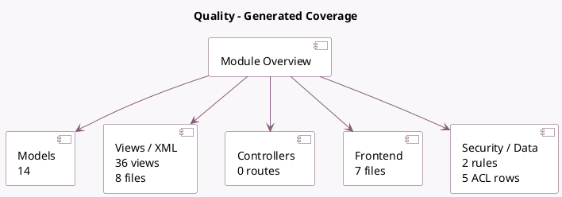

<!-- GENERATED:MODULE -->
---
tags: [odoo, enterprise, module]
---

# Quality

- Scope: Enterprise Addons
- Source: enterprise/quality_control
- Dependencies: [[docs/Enterprise Addons/quality/quality|quality]], [[docs/Enterprise Addons/spreadsheet_edition/spreadsheet_edition|spreadsheet_edition]]

## Summary

Control the quality of your products

## Generated coverage

- Models: 14
- XML files with UI/data artifacts: 8
- Views: 36
- Actions: 20
- Menus: 18
- Rules (ir.rule): 2
- Access CSV entries: 5
- Controller units: 0
- Frontend asset files: 7

## Module map

## Detail notes

- Models: [[docs/Enterprise Addons/quality_control/Models|Models]] (14)
- Views and XML: [[docs/Enterprise Addons/quality_control/Views|Views]] (8 files)
- Frontend: [[docs/Enterprise Addons/quality_control/Frontend|Frontend]] (7 files)

## Key models

- `product.product`
- `product.template`
- `quality.alert`
- `quality.check`
- `quality.check.spreadsheet`
- `quality.check.wizard`
- `quality.point`
- `quality.spreadsheet.template`
- `report.quality_control.quality_worksheet`
- `report.quality_control.quality_worksheet_internal`
- `stock.lot`
- `stock.move`

## Navigation

- [[../Enterprise Addons/Enterprise Addons|Back to scope]]
- [[../../docs/docs|Back to docs]]

<!-- GENERATED:MODULE -->

