<!-- GENERATED:MODEL -->
---
tags: [odoo, enterprise, generated, model]
---

# quality.check

- Module: [[docs/Enterprise Addons/quality_control_worksheet/quality_control_worksheet|quality_control_worksheet]]
- Scope: Enterprise Addons
- Defined in module: extension only
- Source files: `models/quality.py`
- Python classes: `QualityCheck`

## Field footprint

- Detected fields: 2
- Field types: `Integer` x 1, `Many2one` x 1
- Relation fields: 1

## Sample fields

- `worksheet_count`: `Integer` (compute `_compute_worksheet_count`)
- `worksheet_template_id`: `Many2one` (comodel `worksheet.template`, compute `_compute_worksheet_template_id`, store `True`)

## Method hints

- Detected methods: 9
- Action methods: `action_generate_next_window`, `action_open_quality_check_wizard`, `action_quality_worksheet`, `action_worksheet_check`, `action_worksheet_discard`
- Compute methods: `_compute_worksheet_count`, `_compute_worksheet_template_id`
- Onchange methods: none

## Direct relation diagram

```plantuml
@startuml
!define ODOO_COLOR_PRIMARY #714B67
!define ODOO_COLOR_ACCENT #875A7B
!define ODOO_COLOR_BG #FAF7FA

skinparam backgroundColor ODOO_COLOR_BG
skinparam defaultTextAlignment left
skinparam ArrowColor ODOO_COLOR_ACCENT
skinparam ClassBackgroundColor white
skinparam ClassBorderColor ODOO_COLOR_PRIMARY
skinparam ComponentBackgroundColor white
skinparam ComponentBorderColor ODOO_COLOR_PRIMARY
skinparam NoteBackgroundColor #FFF8FF
skinparam NoteBorderColor ODOO_COLOR_ACCENT
skinparam SequenceLifeLineBorderColor ODOO_COLOR_ACCENT
skinparam SequenceLifeLineBackgroundColor #FFFFFF
skinparam SequenceParticipantBorderColor ODOO_COLOR_PRIMARY
skinparam SequenceParticipantBackgroundColor #FFFFFF
skinparam sequence {
  ArrowColor ODOO_COLOR_ACCENT
  ActorBorderColor ODOO_COLOR_PRIMARY
}
title quality.check - Direct Relations
class "quality.check" as quality_check
class "worksheet.template" as worksheet_template
quality_check --> worksheet_template : worksheet_template_id
@enduml
```

## Navigation

- **Parent:** [[docs/Enterprise Addons/quality_control_worksheet/Models]]

<!-- GENERATED:MODEL -->
