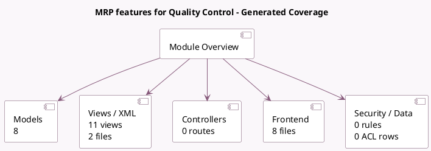

<!-- GENERATED:MODULE -->
---
tags: [odoo, enterprise, module]
---

# MRP features for Quality Control

- Scope: Enterprise Addons
- Source: enterprise/quality_mrp_workorder
- Dependencies: [[docs/Enterprise Addons/quality_control/quality_control|quality_control]], [[docs/Enterprise Addons/mrp_workorder/mrp_workorder|mrp_workorder]], [[docs/Community Addons/barcodes/barcodes|barcodes]]

## Summary

Quality Management with MRP

## Generated coverage

- Models: 8
- XML files with UI/data artifacts: 2
- Views: 11
- Actions: 3
- Menus: 0
- Rules (ir.rule): 0
- Access CSV entries: 0
- Controller units: 0
- Frontend asset files: 8

## Module map

## Detail notes

- Models: [[docs/Enterprise Addons/quality_mrp_workorder/Models|Models]] (8)
- Views and XML: [[docs/Enterprise Addons/quality_mrp_workorder/Views|Views]] (2 files)
- Frontend: [[docs/Enterprise Addons/quality_mrp_workorder/Frontend|Frontend]] (8 files)

## Key models

- `mrp.production`
- `mrp.workorder`
- `product.product`
- `product.template`
- `quality.check`
- `quality.point`
- `stock.lot`
- `stock.move.line`

## Navigation

- [[../Enterprise Addons/Enterprise Addons|Back to scope]]
- [[../../docs/docs|Back to docs]]

<!-- GENERATED:MODULE -->

