<!-- GENERATED:MODEL -->
---
tags: [odoo, enterprise, generated, model]
---

# repair.order

- Module: [[docs/Enterprise Addons/quality_repair/quality_repair|quality_repair]]
- Scope: Enterprise Addons
- Defined in module: extension only
- Source files: `models/repair.py`
- Python classes: `RepairOrder`

## Field footprint

- Detected fields: 5
- Field types: `Boolean` x 2, `Integer` x 1, `One2many` x 2
- Relation fields: 2

## Sample fields

- `quality_alert_count`: `Integer` (compute `_compute_quality_alert_count`)
- `quality_alert_ids`: `One2many` (comodel `quality.alert`)
- `quality_check_fail`: `Boolean` (compute `_compute_quality_check_counts`)
- `quality_check_ids`: `One2many` (comodel `quality.check`)
- `quality_check_todo`: `Boolean` (compute `_compute_quality_check_counts`)

## Method hints

- Detected methods: 11
- Action methods: `action_check_quality`, `action_open_quality_alerts`, `action_open_quality_checks`, `action_repair_cancel`, `action_repair_done`
- Compute methods: `_compute_quality_alert_count`, `_compute_quality_check_counts`
- Onchange methods: none

## Direct relation diagram

```plantuml
@startuml
!define ODOO_COLOR_PRIMARY #714B67
!define ODOO_COLOR_ACCENT #875A7B
!define ODOO_COLOR_BG #FAF7FA

skinparam backgroundColor ODOO_COLOR_BG
skinparam defaultTextAlignment left
skinparam ArrowColor ODOO_COLOR_ACCENT
skinparam ClassBackgroundColor white
skinparam ClassBorderColor ODOO_COLOR_PRIMARY
skinparam ComponentBackgroundColor white
skinparam ComponentBorderColor ODOO_COLOR_PRIMARY
skinparam NoteBackgroundColor #FFF8FF
skinparam NoteBorderColor ODOO_COLOR_ACCENT
skinparam SequenceLifeLineBorderColor ODOO_COLOR_ACCENT
skinparam SequenceLifeLineBackgroundColor #FFFFFF
skinparam SequenceParticipantBorderColor ODOO_COLOR_PRIMARY
skinparam SequenceParticipantBackgroundColor #FFFFFF
skinparam sequence {
  ArrowColor ODOO_COLOR_ACCENT
  ActorBorderColor ODOO_COLOR_PRIMARY
}
title repair.order - Direct Relations
class "repair.order" as repair_order
class "quality.alert" as quality_alert
class "quality.check" as quality_check
repair_order --|> quality_check : quality_check_ids
repair_order --|> quality_alert : quality_alert_ids
@enduml
```

## Navigation

- **Parent:** [[docs/Enterprise Addons/quality_repair/Models]]

<!-- GENERATED:MODEL -->
